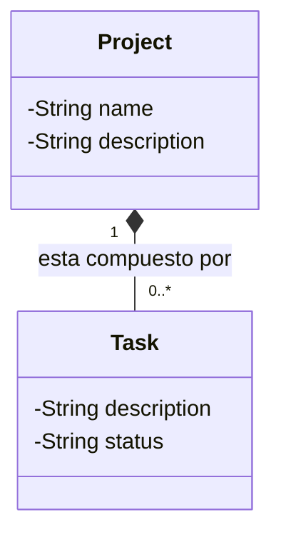
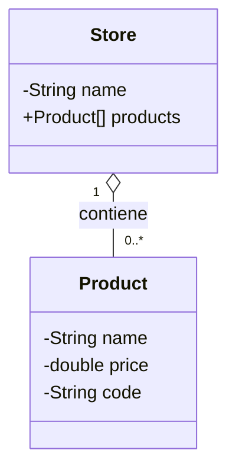
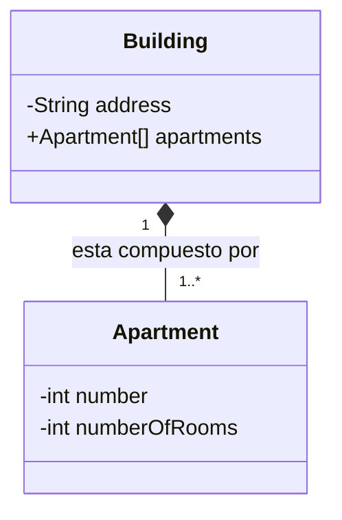
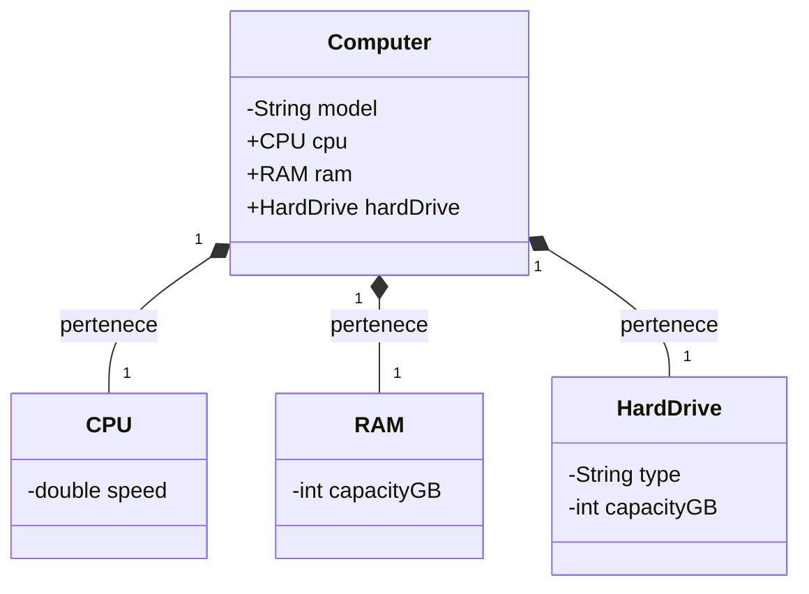

# Ejercicios adicionales

## Ejercicio 1: Sistema de Gestión de Proyectos y Tareas

Necesitas modelar un sistema simple para gestionar proyectos y las tareas asociadas a ellos. Cada proyecto tiene un nombre y una descripción. Un proyecto está compuesto por varias tareas. Cada tarea tiene una descripción y un estado (ej. "Pendiente", "Completa"). Cuando un proyecto se elimina, sus tareas asociadas ya no tienen sentido en ese contexto.

- **Funcionalidades esperadas**:
  - Representar las características de un proyecto.
  - Representar las características de una tarea.
  - Modelar la relación donde un proyecto incluye varias tareas. Decide si esta relación es Composición o Agregación y justifícalo en tu código y comentarios.
  - Permitir crear un proyecto con un número máximo de tareas.
  - Permitir añadir tareas a un proyecto.
  - Permitir mostrar todas las tareas de un proyecto.
  - (Opcional) Permitir marcar una tarea como completa.

## Ejercicio 2: Catálogo de Productos de una Tienda

Modela un sistema para representar un catálogo de productos en una tienda. La tienda tiene un nombre y un conjunto de productos. Cada producto tiene un nombre, un precio y un código. Los productos existen independientemente de la tienda (podrían venderse en otra tienda).

- **Funcionalidades esperadas**:
  - Representar las características de una tienda.
  - Representar las características de un producto.
  - Modelar la relación donde una tienda tiene varios productos en su catálogo. Decide si esta relación es Composición o Agregación y justifícalo.
  - Permitir crear una tienda con un nombre y un catálogo inicial de productos (pasado al crear la tienda).
  - Permitir añadir nuevos productos al catálogo de la tienda (si el Array tiene espacio o si decides gestionarlo).
  - Permitir mostrar todos los productos disponibles en el catálogo de la tienda.
  - (Opcional) Permitir buscar un producto por su código en el catálogo.

## Ejercicio 3: Estructura de un Edificio y sus Apartamentos

Diseña un modelo para representar un edificio de apartamentos. Un edificio tiene una dirección y está compuesto por varios apartamentos. Cada apartamento tiene un número y un número de habitaciones. Un apartamento no puede existir sin el edificio al que pertenece.

- **Funcionalidades esperadas**:
  - Representar las características de un edificio.
  - Representar las características de un apartamento.
  - Modelar la relación donde un edificio contiene varios apartamentos. Decide si esta relación es Composición o Agregación y justifícalo.
  - Permitir crear un edificio especificando el número total de apartamentos que tendrá.
  - Permitir crear y añadir apartamentos al edificio (probablemente al construir el edificio o poco después).
  - Permitir mostrar la información de todos los apartamentos en un edificio.
  - (Opcional) Permitir encontrar un apartamento específico por su número dentro del edificio.

## Ejercicio 4: Composición de un Computador

Modela las partes principales que componen un computador. Un computador tiene un modelo. Un computador está compuesto por una CPU, una Memoria RAM y un Disco Duro. Estas partes, una vez ensambladas en un computador particular, lógicamente pertenecen a ese computador. Cada parte tiene características propias (ej. CPU: velocidad, Memoria: capacidad, Disco: tipo y capacidad).

- **Funcionalidades esperadas**:
  - Representar las características de un computador.
  - Representar las características de una CPU.
  - Representar las características de una Memoria RAM.
  - Representar las características de un Disco Duro.
  - Modelar la relación donde un computador está compuesto por una CPU, una Memoria RAM y un Disco Duro. Decide si esta relación es Composición o Agregación y justifícalo.
  - Permitir crear un computador ensamblándolo con instancias específicas de CPU, Memoria y Disco.
  - Permitir mostrar la configuración completa del computador (detalles de cada una de sus partes).
  - (Opcional) Implementar un método encender() en el computador que quizás llame a métodos de sus partes.
