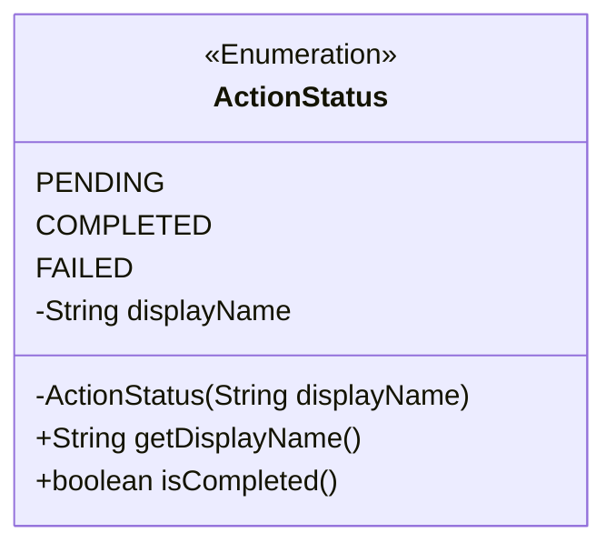

# Clase 4: Proyecto Integrador Orientado a Objetos

¡Felicidades por llegar a la última clase del Módulo 2! Has cubierto un conjunto robusto de herramientas de la Programación Orientada a Objetos: Clases, Objetos, Encapsulamiento, Herencia, Polimorfismo (sobrecarga y sobrescritura), Interfaces, Clases Abstractas, Relaciones entre clases (Asociación, Composición, Agregación) y el uso básico de Arrays para colecciones simples.

El objetivo principal de esta clase es que apliques y consolides todos estos conceptos en un **Proyecto Integrador**. Pero antes, abordaremos algunas herramientas y prácticas esenciales para organizar y estructurar tu código de manera más efectiva, especialmente a medida que los proyectos crecen en complejidad.

## Objetivos de Aprendizaje

Al finalizar esta clase, serás capaz de:

- Utilizar **Enums** para modelar conjuntos fijos y seguros de valores.
- Organizar tus clases utilizando **paquetes** de Java.
- Comprender y aplicar una estructura básica de **arquitectura por capas** para organizar proyectos.
- Documentar tu código de forma profesional utilizando **Javadoc**.
- Aplicar e **integrar** todos los conceptos de POO del Módulo 2 para diseñar y construir un sistema funcional.
- Implementar **validaciones básicas** y **manejo de errores**.
- Aplicar **buenas prácticas de codificación** en Java para escribir código limpio y mantenible.
- Iniciar la implementación del **Proyecto Integrador: Sistema de Gestión de Clientes**.

## 1. Enums: Constantes con Significado

En muchos sistemas, necesitas representar un conjunto fijo y conocido de valores. Por ejemplo: los días de la semana, los meses del año, los estados de un pedido ("Pendiente", "Enviado", "Entregado"), los roles de usuario ("Administrador", "Estándar"), los puntos cardinales (Norte, Sur, Este, Oeste).

Una **Enum** (enumeración) en Java es un tipo de clase especial diseñado precisamente para esto. Define un conjunto limitado de constantes con nombre, que son los únicos valores posibles para ese tipo.

### ¿Por qué usar Enums en lugar de `int` o `String`?

- **Seguridad de Tipo**: Con un Enum, solo puedes asignar los valores definidos en él. Si usas `int` o `String`, podrías accidentalmente asignar un número o una cadena que no tiene sentido en tu lógica (ej. un estado de pedido "PendienteX", o un rol con el número 99). El compilador te ayuda a prevenir errores.
- **Legibilidad**: `OrderStatus.DELIVERED` es mucho más claro que 3 o "Entregado".
- **Mantenibilidad**: Si necesitas cambiar el nombre de un estado o añadir uno nuevo, solo lo cambias en la definición del Enum. Si usaras Strings, tendrías que buscar y reemplazar en todo el código.
- **Permiten Comportamiento**: Los Enums pueden tener atributos, constructores y métodos, lo que les permite ser más que simples valores y encapsular lógica relacionada (como un nombre descriptivo).

### Declaración de un Enum

Se usa la palabra clave `enum`. Las constantes se listan al principio, separadas por comas, y terminando con punto y coma `;` si hay atributos, constructores o métodos.



```Java
/**
 * Representa los posibles estados de una acción de usuario.
 */
public enum ActionStatus {
    // Constantes de la enumeración
    PENDING("Pendiente"),
    COMPLETED("Completada"),
    FAILED("Fallida");

    private String displayName; // Atributo para el nombre a mostrar - Attribute for display name

    // Constructor (implícitamente privado)
    // Nota: Los constructores de un Enum son llamados automáticamente al cargar la enumeración
    ActionStatus(String displayName) {
        this.displayName = displayName;
    }

    // Getter para el atributo
    public String getDisplayName() {
        return this.displayName;
    }

    // Ejemplo de otro metodo
    public boolean isCompleted() {
        return this == COMPLETED; // Comparamos con la constante del Enum
    }
}
```

- Los constructores de un Enum son siempre implícitamente `private`. No puedes usar `new` para crear instancias de un Enum.
- Las constantes del Enum (ej. `PENDING`, `COMPLETED`) son instancias estáticas y finales de la clase Enum.

### Uso de Enums en tu Código

Declaras variables usando el nombre del Enum como tipo de dato y asignas una de sus constantes.

```Java
// Asumiendo que ActionStatus Enum esta en el mismo paquete o importado

public class UserAction {
    private String description;
    private ActionStatus status; // Usamos el Enum para el estado
    private long timestamp; // Marca de tiempo - Timestamp

    public UserAction(String description) {
        this.description = description;
        this.status = ActionStatus.PENDING; // Estado inicial usando una constante del Enum
        this.timestamp = System.currentTimeMillis();
        System.out.println("Acción '" + this.description + "' creada con estado: " + this.status.getDisplayName());
    }

    public void completeAction() {
        this.status = ActionStatus.COMPLETED; // Cambia el estado a otra constante del Enum
        System.out.println("Acción '" + this.description + "' marcada como: " + this.status.getDisplayName());
    }

    // Getter para el estado
    public ActionStatus getStatus() {
        return this.status;
    }

    // Ejemplo de uso del Enum para logica
    public void checkStatus() {
        if (this.status.isCompleted()) { // Usamos un metodo del Enum
            System.out.println("La acción ya ha terminado.");
        } else {
            System.out.println("La acción aún está en curso.");
        }
    }
}
```

En el Proyecto Integrador, los Enums serán muy útiles para representar los Roles de Usuario (`UserRole`) y quizás los estados de alguna otra entidad si decides añadirlos.

## 2. Organización del Código: Paquetes y Arquitectura de Capas

A medida que tus proyectos crecen más allá de unas pocas clases, se vuelve esencial organizarlas de manera lógica. Los **paquetes** y la **arquitectura por capas** te ayudan con esto.

### 2.1. Paquetes (package, import)

Son el mecanismo de Java para organizar clases en grupos lógicos (similar a carpetas en un sistema de archivos) y proporcionar un espacio de nombres.

#### 2.1.1. Propósito

- **Organización**: Agrupar clases relacionadas (ej. todas tus clases de "modelo" van juntas).
- **Evitar Conflictos de Nombres**: Dos clases con el mismo nombre (ej. `User`) pueden coexistir si están en paquetes diferentes (ej. `com.app.security.User` y `com.app.crm.User`).
- **Control de Acceso**: Los miembros con modificador de acceso "default" son visibles solo dentro del mismo paquete. Los `protected` son visibles en el paquete y subclases.

#### 2.1.23 Declaración

La primera línea ejecutable de cada archivo `.java` debe ser la declaración del paquete al que pertenece la clase. Corresponde a la ruta de carpetas (usando puntos en lugar de barras).

```Java
// Declara que esta clase pertenece a este paquete
package com.mycompany.system.model;

public class User {
    // ... class content ...
}
```

#### 2.1.3. Importación

Si una clase necesita usar otra clase que está en un paquete diferente, debe importarla.

```Java
// Declaracion del paquete de esta clase
package com.mycompany.system.service;

// Importa la clase User del paquete model
import com.mycompany.system.model.User;
// Importa el Enum UserRole del paquete model
import com.mycompany.system.model.UserRole;

public class UserManager {
    private User[] users; // Podemos usar User porque lo importamos

    // ... constructor y metodos ...

    public void assignRole(User user, UserRole newRole) {
        // ... logica que usa User y UserRole ...
    }
}
```

- Puedes importar clases individuales (`import com.pkg.MyClass;`).
- Puedes importar todas las clases públicas de un paquete (NO recomendado en código de producción, solo para conveniencia en ejemplos pequeños) (`import com.pkg.*;`).
- Las clases del paquete `java.lang` (como `String`, `System`, `Math`) se importan automáticamente.
- Las clases dentro del mismo paquete no necesitan importarse entre sí.

### 2.2. Arquitectura por Capas (Simple en POO Java)

Es un principio de diseño para estructurar la aplicación en divisiones lógicas (**capas**) donde cada capa tiene una responsabilidad específica y solo se comunica con las capas adyacentes (típicamente en una dirección descendente). Esto mejora la organización, la mantenibilidad y la capacidad de prueba.

- **Capa de Modelo (`model`)**: Contiene las clases que representan las entidades del negocio y su estado (ej. `User`, `Role`, `Action`, `ItemMenu`, `Order`). No deben contener lógica de negocio compleja o de interfaz de usuario.
- **Capa de Servicio / Lógica de Negocio (`service`)**: Contiene las clases que implementan las reglas de negocio y la lógica principal de la aplicación (ej. `UserManager` - maneja la creación/eliminación/búsqueda de usuarios, aplica reglas de roles). Esta capa opera sobre los objetos de la capa de Modelo. Conoce a la capa de Modelo.
- **Capa de Presentación / Aplicación (`app` o `ui`)**: Contiene el punto de entrada de la aplicación (la clase con `main`), maneja la interacción con el usuario (leer entrada, mostrar salida en consola en este caso). Conoce a la capa de Servicio para solicitarle que realice acciones. No debe contener lógica de negocio compleja.

#### Estructura de Carpetas y Paquetes Sugerida para el Proyecto

```text
university-system/
└── src/
    └── com/
        └── mycompany/     // Usa tu propio nombre de empresa/dominio aquí
            └── system/    // Nombre del sistema/proyecto
                └── model/   // Capa de Modelo
                └── service/ // Capa de Servicio/Lógica de Negocio
                └── app/     // Capa de Presentación/Aplicación
                    └── App.java // Clase con el main
```

Asegúrate de que cada archivo `.java` tenga la declaración `package` correcta correspondiente a su ubicación en la estructura de carpetas.

## 3. Documentación con Javadoc

Documentar tu código es crucial para explicar qué hacen tus clases, métodos y parámetros. Java tiene una herramienta estándar llamada Javadoc que genera documentación HTML a partir de comentarios especiales en tu código.

- **Comentarios Javadoc**: Empiezan con `/**` y terminan con `*/`. Se colocan justo antes de la declaración de la clase, interfaz, constructor o método (miembros `public` y `protected` son los que típicamente se documentan con Javadoc).
- Etiquetas **Javadoc**: Dentro del comentario Javadoc, puedes usar etiquetas especiales que empiezan con `@`.

  ```Java
  package com.mycompany.system.model;

  /**
    * Representa un usuario en el sistema con un rol específico y historial de acciones.
    * Permite modelar usuarios con diferentes permisos basados en su rol.
    *
    * @author Tu Nombre        // Indica el autor
    * @version 1.0            // Indica la version
    */
  public class User {
      // ... atributos privados ...
      private String name;
      private String userId;
      private String username;
      private String password; // Almacenamiento de contraseña simplificado
      private UserRole role;   // Usamos el Enum UserRole
      private Action[] actionHistory; // Historial de acciones
      private int actionCount = 0; // Contador de acciones

      /**
       * Crea un nuevo Usuario con información básica y un rol.
        * Inicializa el array del historial de acciones.
        *
        * @param name El nombre completo del usuario.
        * @param userId El ID único del usuario.
        * @param El nombre de usuario para iniciar sesion.
        * @param La contraseña para iniciar sesion.
        * @param El rol asignado al usuario (ej. ADMIN, STANDARD).
        */
      public User(String name, String userId, String username, String password, UserRole role) {
          this.name = name;
          this.userId = userId;
          this.username = username;
          this.password = password;
          this.role = role;
          // Inicializar array historial con capacidad fija
          this.actionHistory = new Action[100]; // Ejemplo: capacidad para 100 acciones
          System.out.println("Usuario '" + this.username + "' creado con ID: " + this.userId);
      }

      /**
       * Obtiene el rol del usuario.
        * @return El UserRole del usuario. // Describe el valor retornado
        */
      public UserRole getRole() {
          return this.role;
      }

      /**
       * Verifica si el usuario tiene el rol de Administrador.
        * @return true si el usuario es administrador, false en otro caso.
        */
      public boolean isAdmin() {
          return this.role == UserRole.ADMIN;
      }

      /**
       * Añade una acción al historial del usuario.
        * Maneja el caso si el array del historial está lleno.
        *
        * @param action La acción a añadir al historial.
        */
      public void addAction(Action action) {
          if (this.actionCount < this.actionHistory.length) {
              this.actionHistory[this.actionCount] = action;
              this.actionCount++;
              System.out.println("Acción registrada para usuario '" + this.username + "': " + action.getDescription()); // Assuming Action has getDescription()
          } else {
              System.out.println("ERROR: Historial de acciones del usuario '" + this.username + "' lleno. No se pudo registrar la acción: " + action.getDescription());
          }
      }

      // ... otros getters y metodos ...
  }
  ```

- **Generar la Documentación**: Puedes usar el comando `javadoc` desde la terminal en la raíz de tu proyecto para generar la documentación HTML:

  ```Bash
  javadoc -d doc src/com/mycompany/system/model/*.java src/com/mycompany/system/service/*.java ...
  ```

  (Ajusta la ruta `src/...` para que apunte a tus archivos Java). El directorio `doc` contendrá los archivos HTML generados.

## 4. El Proceso de Desarrollo de un Proyecto POO

Desarrollar un proyecto utilizando POO no es solo escribir código; implica un proceso de pensamiento y diseño. Aquí te sugerimos un enfoque:

- **Paso 1: Análisis de Requerimientos**: Entender el problema. ¿Qué debe hacer el sistema? ¿Quiénes lo usarán? ¿Qué información necesita manejar?
- **Paso 2: Diseño Orientado a Objetos**: Modelar la solución. Identificar las "cosas" (clases), sus características (atributos), sus acciones (métodos) y cómo se relacionan entre sí. Decidir qué principios de POO (herencia, interfaces, etc.) aplicar. Diagramar tu diseño.
- **Paso 3: Implementación**: Escribir el código en Java, clase por clase, implementando el diseño.
- **Paso 4: Validación y Manejo de Errores**: Asegurar que el sistema maneje datos inválidos y situaciones inesperadas de manera robusta.
- **Paso 5: Documentación**: Explicar cómo funciona tu código para que otros (¡incluido tu futuro yo!) puedan entenderlo.
- **Paso 6: Pruebas**: Verificar que el sistema funciona correctamente según los requerimientos.

Ahora, apliquemos todo esto al Proyecto Integrador:

- **Análisis de Requerimientos**: Relee los requerimientos del Sistema de Gestión de Clientes. Basado en los requerimientos anteriores, analicemos las "cosas" y "acciones":
  - **Entidades (Clases Potenciales)**: ¿Quiénes son los principales actores o conceptos que necesitan ser representados?
    - ¿Necesitamos una clase para gestionar a los usuarios?
  - **Atributos**: ¿Qué información necesita almacenar cada una de estas clases?
  - **Métodos (Comportamientos)**: ¿Qué acciones debe poder realizar cada clase?
  - **Relaciones**: ¿Cómo se conectan estas clases?
- **Diseño Orientado a Objetos**: Ahora, usemos los conceptos de POO para estructurar nuestra solución
  - **Identifica tus Clases Principales**: Define las clases basándote en el análisis.
  - **Atributos Privados**: Asegúrate de que todos los atributos que representan el estado de un objeto sean `private`.
  - **Constructores**: Define constructores adecuados para inicializar los objetos cuando se crean.
  - **Herencia (`extends`)**: ¿Hay diferentes tipos de usuarios que comparten características pero tienen comportamientos o atributos específicos? Podrías tener una clase base `User` y subclases como `AdminUser` o `StandardUser` si sus diferencias de comportamiento justifican la herencia (ej. si `AdminUser` tuviera métodos `deleteUser` o `createUser` directamente, o si hubiera atributos solo para administradores). O, más simple para este ejercicio, la distinción podría basarse solo en el objeto Role asociado a un único tipo de clase `User`.
  - **Interfaces (`interface`, `implements`)**: ¿Hay algún comportamiento común que diferentes clases (potencialmente no relacionadas) podrían compartir? (Ej: Quizás una interfaz `Authenticable` si tuviéramos diferentes cosas que pudieran iniciar sesión, aunque quizás no sea necesario para este diseño simple).
  - **Clases Abstractas (`abstract`)**: ¿Hay alguna clase base que no tenga sentido ser instanciada por sí sola, pero que sirva como plantilla para otras? (Ej: Si tuvieras una jerarquía de diferentes tipos de Acciones, podrías tener una clase base abstracta `Action`).
  - **Relaciones "Tiene Un" (Asociación, Composición, Agregación)**
  - **Diagramación**: Dibuja tu diseño en papel o usando una herramienta. Esto te ayudará a visualizar las clases, sus atributos, métodos y las relaciones con flechas y rombos.
- **Implementación**:
  - Crea la estructura de carpetas y archivos `.java` con las declaraciones `package` correctas.
  - Empieza a codificar clase por clase, siguiendo tu diseño.
  - Implementa los atributos privados y los constructores.
  - Implementa los getters y setters (aplicando validación básica donde tenga sentido).
  - Implementa los métodos de relación.
  - Implementa los métodos de comportamiento y lógica de negocio.
  - Usa **Enums** en tus clases.
  - Aplica **buenas prácticas** (nombres, encapsulamiento, métodos cortos).
  - Añade **Javadoc** a tus clases, constructores y métodos públicos/protected.
  - Incluye comentarios `//` o `/* */` en español para explicar partes específicas del código.
  - Incluye mensajes de salida (`System.out.println`, `printf`) en español para la interacción en la consola.
- **Validación y Manejo de Errores**: Asegúrate de implementar las validaciones basadas en roles y los mensajes de error correspondientes. Maneja casos como arrays llenos o usuarios no encontrados.
  - **Validación en Setters**: En los setters donde aplique (ej. setPassword), añade validación simple (ej. no vacío). Si la validación falla, puedes imprimir un mensaje de error en español y no modificar el atributo.
  - **Validación en Métodos**: En métodos como `createUser`, `deleteUser`, `updateUser`, `login`, etc., verifica las reglas de negocio (ej. ¿el usuario que realiza la acción tiene rol de Administrador? ¿Existe el usuario a eliminar/actualizar?). Si las reglas no se cumplen, imprime mensajes de error en español.
  - **Manejo de Arrays**: Verifica siempre que los índices sean válidos (0 <= index < array.length) y que las posiciones del array de objetos no sean null antes de intentar acceder a sus métodos o atributos.

- **Pruebas Manuales**: Usa tu método `main` para probar exhaustivamente las diferentes funcionalidades y escenarios (intentar acceso denegado, probar validaciones, etc.).

## 5. Buenas Prácticas de Codificación en Java

Además de lo mencionado sobre Enums, Paquetes y Arquitectura, recuerda otras buenas prácticas:

- **Coherencia**: Sé consistente en tu estilo de formateo, nombres y estructura.
- **Principio DRY (Don't Repeat Yourself)**: Evita duplicar bloques de código. Si te encuentras escribiendo la misma lógica varias veces, considera ponerla en un método.
- **Uso de `final`**: Usa la palabra clave `final` para variables (locales o atributos) que no cambiarán de valor una vez inicializadas, y para parámetros que no modificarás dentro de un método. Esto mejora la legibilidad y seguridad.
- **Evitar Números y Cadenas Mágicas**: Usa constantes o Enums para valores que tienen un significado más allá de sí mismos.
- **Manejo de Arrays**: Recuerda siempre verificar límites de índices y null en arrays de objetos.

## 6. Pruebas Manuales en `main`

Tu método `main` es tu entorno de prueba. Úsalo para crear un escenario que demuestre cada requerimiento y cada regla de negocio del proyecto. Prueba los casos de éxito y los casos de error.

- Crear instancias de Roles (Admin, Standard).
- Crear instancias de Users con diferentes roles.
- Crear una instancia de UserManager.
- Añadir usuarios al UserManager.
- Simular escenarios:
  - Intentar crear un usuario siendo un usuario estándar (debe fallar).
  - Crear un usuario siendo un usuario administrador (debe funcionar).
  - Simular inicio de sesión exitoso e fallido.
  - Intentar ver/actualizar el perfil de otro usuario siendo estándar (debe fallar).
  - Ver/actualizar el propio perfil siendo estándar (debe funcionar).
  - Ver/actualizar el perfil de cualquier usuario siendo administrador (debe funcionar).
  - Registrar algunas acciones para los usuarios.
  - Mostrar el historial de acciones de un usuario.

## Resumen de la Clase

- Aprendiste a usar **Enums** como una forma robusta y legible de modelar conjuntos fijos de constantes.
- Entendiste la importancia de **paquetes** y **arquitectura por capas** para organizar proyectos de POO a medida que crecen.
- Aprendiste a documentar tu código con **Javadoc**.
- Abordaste el **proceso de desarrollo de un proyecto POO**, desde el análisis hasta la implementación y pruebas.
- Comenzaste a aplicar de forma integrada todos los conceptos del Módulo 2 en el **Proyecto Integrador: Sistema de Gestión de Clientes**, enfocándote en modelado, relaciones (con Arrays), encapsulamiento, validación y organización del código.

Este [proyecto](3-proyecto.md) es tu oportunidad para consolidar todo lo aprendido.

¡Enfócate en un diseño limpio y código bien estructurado!
