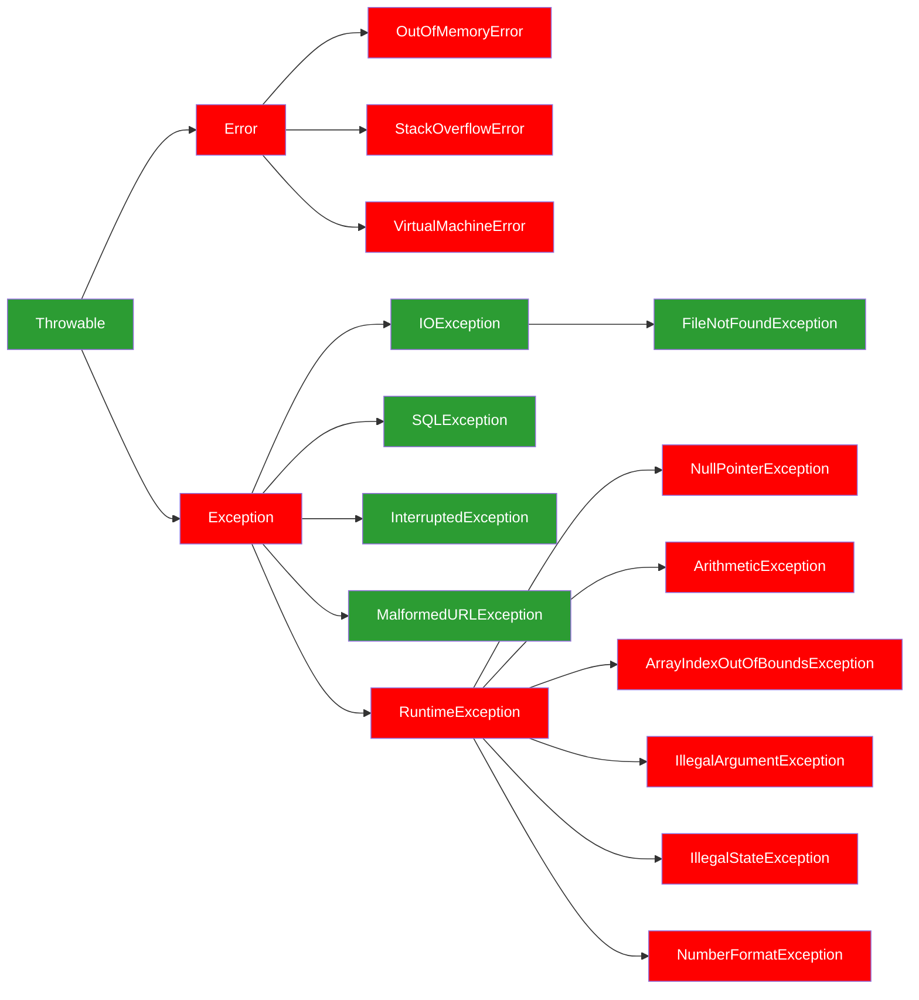

# Clase 1: Gestores de Proyectos, Excepciones y Manejo de Errores en Java

¡Hola a todos! Bienvenidos al Módulo 3. En esta etapa de su viaje como desarrolladores, trascenderemos las bases de la POO para construir aplicaciones que no solo sean funcionales, sino también **profesionales, robustas, eficientes y fáciles de mantener**. Este es el salto cualitativo hacia el desarrollo de software de alta calidad.

Hoy, nos sumergiremos en dos pilares fundamentales del ecosistema Java moderno: los **gestores de proyectos** y el **manejo avanzado de excepciones**. Ambas herramientas son cruciales para el desarrollo colaborativo, la integración continua y, en definitiva, para escribir código que funcione de manera fiable en cualquier entorno.

## Objetivos de Aprendizaje

Al finalizar esta clase, serás capaz de:

- **Explicar la importancia y el uso de gestores de proyectos** como Maven y Gradle para automatizar el ciclo de vida del software Java, incluyendo la gestión de dependencias y la estandarización del build.
- **Diferenciar entre errores y excepciones en Java**, identificando su jerarquía y la filosofía detrás de las excepciones verificadas y no verificadas.
- **Manejar excepciones de forma efectiva** utilizando los bloques `try-catch-finally` y las palabras clave `throw` y `throws` para controlar el flujo del programa ante situaciones inesperadas.
- **Crear y aplicar excepciones personalizadas** para representar errores específicos de la aplicación, siguiendo las mejores prácticas en el manejo de errores.

## 1. Gestores de Proyectos Java: Maven y Gradle

En el desarrollo de software real, los proyectos rara vez son un solo archivo `Main.java`. Rápidamente crecen, necesitan funcionalidades externas (librerías) y requieren pasos complejos para ser convertidos de código fuente a una aplicación ejecutable. Imaginen construir una casa grande: necesitan un arquitecto que coordine los planos, un capataz que gestione a los trabajadores y una cadena de suministro que traiga los materiales exactos en el momento justo. En el mundo del software, los **gestores de proyectos** como **Maven** y **Gradle** son ese arquitecto y capataz.

### ¿Qué son y por qué son Absolutamente Indispensables Hoy en Día?

Un gestor de proyectos es una herramienta que **automatiza**, **estandariza** y **centraliza** el ciclo de vida de la construcción (el "build process") de su aplicación. Su misión es transformar el código fuente y otros recursos en un producto final listo para ser ejecutado o distribuido.

1. **Gestión de Dependencias (El Corazón de la Eficiencia)**:
    - **El Problema Pre-Gestores**: Antes de estas herramientas, gestionar las librerías externas era una pesadilla. Implicaba:
      - Descargar manualmente archivos `.jar` de cada librería de sus sitios web (propenso a errores, versiones incorrectas).
      - Añadir esos `.jar`s al "classpath" de su proyecto manualmente.
      - El dolor de cabeza mayor: las **dependencias transitivas**. Si la `Librería A` que ustedes usan, a su vez, necesita la `Librería B` y la `Librería C` en versiones específicas, ¡ustedes eran responsables de encontrar y añadir `B` y `C` también! Esto se volvía exponencialmente complejo, generaba conflictos de versiones y duplicidades.
    - **La Solución (Maven/Gradle)**: Ustedes simplemente **declaran** las librerías directas que su proyecto necesita en un archivo de configuración. El gestor hace el trabajo pesado:
      - Se conecta a **repositorios de librerías** centralizados en Internet (como Maven Central, JCenter).
      - **Descarga automáticamente** las librerías declaradas y, crucialmente, **resuelve y descarga recursivamente todas sus dependencias transitivas**. Esto asegura que siempre tengan las versiones correctas y que no haya conflictos.
      - Mantiene un **repositorio local** (ej. `~/.m2/repository` para Maven) para almacenar las librerías descargadas, acelerando futuras construcciones.
    - **Impacto**: Elimina errores humanos, reduce el tiempo de configuración y garantiza que el proyecto sea reproducible por cualquier persona en cualquier máquina.

2. **Automatización del Ciclo de Vida de la Construcción (El Flujo de Trabajo Estandarizado)**:

    Aquí es donde entra la magia de la automatización en Maven. Más allá de solo ejecutar comandos individuales, Maven define un **ciclo de vida de construcción (Build Lifecycle)** estándar que guía el proceso de transformación del código fuente en un entregable. Este ciclo de vida es una secuencia de **fases** predefinidas, y cada fase puede tener asociados **objetivos (goals)** específicos de **plugins** que se ejecutan automáticamente.

    **Conceptos Clave**:
    - **Ciclo de Vida (Lifecycle)**: Es un proceso formalmente definido y una secuencia de etapas en el proceso de construcción de un proyecto. Maven tiene tres ciclos de vida estándar:
      - **Default (por defecto)**: Es el más importante y completo, maneja la construcción y el despliegue del proyecto.
      - **Clean**: Maneja la limpieza del proyecto.
      - **Site**: Maneja la creación de la documentación del sitio del proyecto. En esta clase, nos enfocaremos en el ciclo de vida **Default**.
    - **Fases (Phases)**: Son etapas específicas dentro de un ciclo de vida. Cuando se invoca una fase, Maven ejecuta todas las fases anteriores en el ciclo de vida hasta llegar a la fase especificada. La ejecución de una fase se logra ejecutando los **objetivos (goals)** de los plugins que están **vinculados** a esa fase.
      - **Ejemplo**: Si ejecutan `mvn package`, Maven primero ejecutará la fase `validate`, luego `compile`, luego `test`, y finalmente `package`.
    - **Objetivos (Goals)**: Son tareas específicas y granulares que pueden ser ejecutadas por sí solas, o pueden ser vinculadas a una o más fases del ciclo de vida. Los objetivos son proporcionados por los **plugins** de Maven.
      - **Ejemplo**: El plugin `maven-compiler-plugin` tiene un objetivo `compile` (`compiler:compile`) que se encarga de compilar el código. Este objetivo está vinculado por defecto a la fase `compile`.

    - **Fases Comunes del Ciclo de Vida "Default"**:

      Entender estas fases es crucial, ya que al ejecutar una, se garantizan que las anteriores ya se han completado.

      **Diagrama**:

      ```mermaid
      flowchart LR
          clean
          validate --> compile --> test
          test --> package --> verify
          verify --> install--> deploy
      ```

      - `clean`: Elimina los artefactos de la construcción anterior (ej. `target/` en Maven).
        - _Comando_: `mvn clean`
      - `validate`: Valida que el proyecto sea correcto y que toda la información necesaria esté disponible. Verifica si el `pom.xml` es válido, si todas las dependencias están declaradas, etc.
        - _Comando_: `mvn validate`
      - `compile`:  Compila el código fuente del proyecto. Transforma los archivos `.java` en archivos `.class` (bytecode) en el directorio `target/classes`.
        - _Comando_: `mvn compile`
      - `test`: Ejecuta las pruebas unitarias del proyecto. Compila y ejecuta las clases de prueba (`src/test/java`). Si alguna prueba falla, la construcción fallará. Los resultados de las pruebas se guardan en `target/surefire-reports`.
        - _Comando_: `mvn test`
      - `package`: Empaqueta el código compilado y los recursos en un formato distribuible (ej. un archivo `.jar` ejecutable o un `.war` para aplicaciones web).
        - _Comando_: `mvn package`
      - `verify`: Ejecuta cualquier verificación para confirmar la calidad de los resultados del paquete. Puede ejecutar pruebas de integración o análisis de código adicionales. Si algo falla aquí, indica que el paquete no cumple con los criterios de calidad.
        - _Comando_: `mvn verify`
      - `install`: Instala el artefacto empaquetado en el repositorio Maven local. Copia el JAR/WAR generado por package a su repositorio Maven local (`~/.m2/repository`). Esto hace que el artefacto esté disponible para otros proyectos Maven en su máquina local.
        - _Comando_: `mvn install`
      - `deploy`: Copia el artefacto final a un **repositorio remoto** (como un Nexus o Artifactory), haciéndolo disponible para otros equipos o sistemas.
        - _Comando_: `mvn deploy`

    - **Impacto de la Estandarización y el Ciclo de Vida**:
      - **Consistencia**: No importa quién construya el proyecto o dónde, el proceso es siempre el mismo, lo que reduce los errores "funciona en mi máquina".
      - **Facilidad de Automatización**: Permite integrar fácilmente los builds en sistemas de Integración Continua (CI/CD) como Jenkins, GitLab CI, GitHub Actions.
      - **Claridad**: Los desarrolladores entienden rápidamente el flujo de trabajo de un proyecto Maven..

3. **Estandarización y Convención sobre Configuración**:
    - Ambos gestores promueven una **estructura de directorios estándar** (ej. `src/main/java` para el código de producción, `src/test/java` para las pruebas, `src/main/resources` para archivos de configuración, etc.). Esta "**convención sobre configuración**" significa que si siguen esta estructura, necesitarán muy poca configuración explícita, ya que el gestor sabe dónde encontrar las cosas.
    - Esto facilita enormemente la **colaboración en equipo** y la incorporación de nuevos desarrolladores al proyecto, ya que la organización es predecible.
    - **Integración con IDEs**: Todos los IDEs modernos (IntelliJ IDEA, Eclipse, VS Code) tienen soporte nativo robusto para Maven y Gradle. Pueden importar proyectos, ejecutar fases de construcción y gestionar dependencias directamente desde la interfaz gráfica.

### Maven en Detalle

Dado que Maven es uno de los gestores más utilizados y su entendimiento es fundamental, vamos a desglosarlo con mayor profundidad, enfocándonos en VS Code como su entorno principal.

1. **Instalación y Configuración de Maven (Guía Rápida para VS Code)**:

    Si bien VS Code simplifica mucho el uso de Maven, es crucial entender cómo funciona por debajo. Idealmente, Maven debería estar instalado globalmente en su sistema.

    - **Paso 1: Verificar Java Development Kit (JDK)**: Maven requiere un JDK instalado y configurado. Asegúrense de tener el JDK 11 o superior. En VS Code, si tienen la **Extension Pack for Java** instalada, ya deberían tener un buen soporte. Pueden verificar su versión de Java abriendo una nueva terminal en VS Code y ejecutando:

      ```Bash
      java -version
      ```

      Y para asegurarse de que `JAVA_HOME` esté configurado correctamente, pueden probar:
      - **Windows - Cmd**: `echo %JAVA_HOME%`
      - **Windows - Powershell**: `echo %JAVA_HOME%`
      - **Linux/macOS**: `echo $JAVA_HOME`

      Si no está configurado, la Extension Pack for Java de VS Code a menudo ayuda a gestionarlo.
    - **Paso 2: Descargar e Instalar Maven**:
      - Vayan al sitio oficial de Apache Maven: `maven.apache.org/download.cgi`
      - Descarguen el archivo ZIP binario (ej. `apache-maven-x.x.x-bin.zip`).
      - **Descompriman** el archivo ZIP en una ubicación accesible de su sistema (ej. `C:\dev\apache-maven-x.x.x` en Windows o `/usr/local/apache-maven-x.x.x` en Linux/macOS).
      - **Configurar Variables de Entorno (Manual)**: Para que Maven funcione desde cualquier terminal:
        - Creen una variable de entorno llamada `M2_HOME` y apúntenla a la ruta donde descomprimieron Maven (ej. `C:\dev\apache-maven-x.x.x`).
        - Añadan `%M2_HOME%\bin` (Windows) o `$M2_HOME/bin` (Linux/macOS) a la variable de entorno Path (o PATH).
      - **Verificar Instalación**: Abran una nueva terminal en VS Code o en su sistema operativo.

        ```Bash
        mvn -v
        ```

        Si la instalación fue exitosa, verán la versión de Apache Maven, la versión de Java, y la ruta del Home de Java.
    - **Paso 3: Extensiones de VS Code para Maven**:
      - Abran VS Code.
      - Vayan a la vista de Extensiones (`Ctrl + Shift + X`).
      - Busquen y instalen la extensión "**Maven for Java**" (generalmente incluida en la Extension Pack for Java). Esta extensión añade el panel de Maven y facilita la interacción con proyectos Maven.

2. **Estructura Estándar de un Proyecto Maven**:

    Maven impone una estructura de directorios muy clara y convencional. Esta es una de las mayores ventajas, ya que cualquier desarrollador familiarizado con Maven sabe exactamente dónde encontrar cada tipo de archivo en su proyecto.

    ```text
    mi-proyecto/
    ├── .vscode/                       <-- Configuraciones específicas de VS Code (opcional)
    ├── pom.xml                        <-- Archivo de configuración principal de Maven
    ├── src/                           <-- Contiene el código fuente y recursos
    │   ├── main/                      <-- Código fuente de producción
    │   │   ├── java/                  <-- Clases Java (.java)
    │   │   └── resources/             <-- Archivos de configuración, propiedades, etc. (.properties, .xml)
    │   └── test/                      <-- Código fuente para pruebas
    │       ├── java/                  <-- Clases Java para pruebas (.java)
    │       └── resources/             <-- Archivos de recursos para pruebas
    └── target/                        <-- Directorio generado por Maven (contiene los .class, .jar/.war, etc.)
    ```

    - `pom.xml`: El corazón del proyecto Maven. Contiene toda la configuración, dependencias, plugins y el ciclo de vida del build.
    - `src/main/java`: Aquí residen sus clases Java de la aplicación principal.
    - `src/main/resources`: Para archivos no-Java que su aplicación necesita en tiempo de ejecución (ej. archivos de configuración de bases de datos, plantillas). Maven copiará estos archivos al `target/classes` cuando compile.
    - `src/test/java`: Aquí van sus clases de prueba unitaria (ej. tests JUnit). Maven las compila y ejecuta por separado del código de producción.
    - `src/test/resources`: Recursos específicos para sus pruebas.
    - `target`: Este directorio es generado por Maven durante el proceso de construcción. Contiene los archivos `.class` compilados, el `.jar` o `.war` empaquetado y cualquier otro artefacto de construcción. Es un directorio que generalmente se excluye del control de versiones (añadiéndolo al `.gitignore`).

3. **Anatomía del `pom.xml` (Project Object Model)**:

    El `pom.xml` es un archivo XML que describe el proyecto Maven. Es la "receta" de su aplicación. Aunque puede ser complejo, entender sus secciones principales es fundamental.

    ```XML
    <?xml version="1.0" encoding="UTF-8"?>
    <project xmlns="http://maven.apache.org/POM/4.0.0"
            xmlns:xsi="http://www.w3.org/2001/XMLSchema-instance"
            xsi:schemaLocation="http://maven.apache.org/POM/4.0.0 http://maven.apache.org/xsd/maven-4.0.0.xsd">
        <modelVersion>4.0.0</modelVersion>

        <groupId>com.miempresa</groupId>
        <artifactId>mi-aplicacion</artifactId>
        <version>1.0.0-SNAPSHOT</version>
        <packaging>jar</packaging>
        <properties>
            <project.build.sourceEncoding>UTF-8</project.build.sourceEncoding>
            <maven.compiler.source>11</maven.compiler.source>
            <maven.compiler.target>11</maven.compiler.target>
            <junit.jupiter.version>5.8.1</junit.jupiter.version>
            <log4j.version>2.17.1</log44j.version>
        </properties>

        <dependencies>
            <dependency>
                <groupId>org.junit.jupiter</groupId>
                <artifactId>junit-jupiter-api</artifactId>
                <version>${junit.jupiter.version}</version>
                <scope>test</scope>
            </dependency>
            <dependency>
                <groupId>org.junit.jupiter</groupId>
                <artifactId>junit-jupiter-engine</artifactId>
                <version>${junit.jupiter.version}</version>
                <scope>test</scope>
            </dependency>

            <dependency>
                <groupId>org.apache.logging.log4j</groupId>
                <artifactId>log4j-api</artifactId>
                <version>${log4j.version}</version>
            </dependency>
            <dependency>
                <groupId>org.apache.logging.log4j</groupId>
                <artifactId>log4j-core</artifactId>
                <version>${log4j.version}</version>
            </dependency>
        </dependencies>

        <build>
            <plugins>
                <plugin>
                    <groupId>org.apache.maven.plugins</groupId>
                    <artifactId>maven-compiler-plugin</artifactId>
                    <version>3.8.1</version>
                    <configuration>
                        <source>${maven.compiler.source}</source>
                        <target>${maven.compiler.target}</target>
                    </configuration>
                </plugin>
                <plugin>
                    <groupId>org.apache.maven.plugins</groupId>
                    <artifactId>maven-surefire-plugin</artifactId>
                    <version>2.22.2</version>
                </plugin>
            </plugins>
            <resources>
                <resource>
                    <directory>src/main/resources</directory>
                </resource>
            </resources>
        </build>

    </project>
    ```

    - **`<project>` (Elemento Raíz)**: Es el contenedor principal de todo el `pom.xml`. Contiene atributos `xmlns` y `xsi:schemaLocation` que definen el esquema XML para la validación del POM.
    - **Coordenadas del Proyecto (`<groupId>`, `<artifactId>`, `<version>`, `<packaging>`)**:
      - Estos cuatro elementos forman la **identificación única** de cualquier proyecto o dependencia en Maven. Son cruciales para que Maven pueda identificar su proyecto y para que otros proyectos puedan depender de él.
      - `<groupId>`: El identificador del grupo o de la organización. Suele seguir la convención de nombres de paquetes Java invertidos (ej. `com.miempresa.mi_area`).
      - `<artifactId>`: El nombre único del artefacto (su proyecto). Generalmente, es el nombre del proyecto o módulo.
      - `<version>`: La versión actual del proyecto. Comúnmente se usa `-SNAPSHOT` para indicar que es una versión en desarrollo y que puede cambiar. Una vez se libera, se le quita `-SNAPSHOT`.
      - `<packaging>`: Define el tipo de artefacto que Maven empaquetará. Los más comunes son:
        - `jar`: Un archivo JAR estándar (Java ARchive), típico para librerías o aplicaciones de consola.
        - `war`: Un archivo WAR (Web ARchive), para aplicaciones web desplegables en servidores como Tomcat o WildFly.
        - `pom`: Indica que este POM es un "proyecto padre" que solo sirve para organizar otros módulos o definir configuraciones comunes.
    - **`<properties>` (Propiedades del Proyecto)**:
      - Permite definir variables personalizadas dentro del `pom.xml`. Esto es excelente para la **reutilización de versiones** de librerías o para definir configuraciones comunes (como la codificación de caracteres o la versión de Java).
      - Se acceden usando la sintaxis `${nombre.de.la.propiedad}`. Por ejemplo, `${maven.compiler.source}`.
    - **`<dependencies>` (Dependencias)**:
      - Este bloque es donde se declaran todas las **librerías externas** de las que depende su proyecto. Cada librería se declara dentro de una etiqueta `<dependency>`.
      - Cada `<dependency>` requiere al menos `groupId`, `artifactId` y `version` de la librería.
      - **`<scope>` (Alcance de la Dependencia)**: Es un atributo muy importante que define cuándo estará disponible una dependencia en el classpath de su proyecto. Los alcances más comunes son:
        - **`compile` (predeterminado)**: La dependencia está disponible en todas las fases del ciclo de vida. Se incluye en el JAR final. (Ej. librerías de utilidad como Apache Commons).
        - **test**: La dependencia solo está disponible durante la fase de compilación y ejecución de las pruebas. No se incluye en el JAR final. (Ej. JUnit, Mockito).
        - **provided**: La dependencia se necesita para compilar y probar, pero se espera que sea proporcionada por el entorno de ejecución (ej. un servidor de aplicaciones como Tomcat). No se incluye en el JAR final. (Ej. `javax.servlet-api` para aplicaciones web).
        - **runtime**: La dependencia se necesita durante la ejecución, pero no para la compilación del código principal. (Ej. un driver JDBC para base de datos).
        - **system**: Similar a `provided`, pero se especifica la ruta explícita al JAR. Usar con precaución, ya que puede romper la portabilidad.
    - **`<build>` (Configuración del Proceso de Construcción)**:
      - Este bloque permite configurar cómo Maven construye el proyecto. Aquí se definen y configuran los **plugins** de Maven.
      - `<plugins>`: Los plugins son extensiones que añaden funcionalidades específicas a Maven. Un plugin puede ejecutar tareas en diferentes fases del ciclo de vida.
        - `maven-compiler-plugin`: Configura la versión de Java que se usará para compilar el código fuente (`<source>`) y el bytecode generado (`<target>`).
        - `maven-surefire-plugin`: Es responsable de ejecutar las pruebas unitarias durante la fase `test`.
      - `<resources>`: Permite especificar directorios que contienen recursos (archivos no-Java) que deben ser incluidos en el JAR/WAR final, como los archivos en `src/main/resources`.

4. **Interacción con Maven: ¡Desde VS Code!**

    Una de las grandes ventajas de VS Code con la extensión `Maven for Java` es que gran parte de la interacción manual se simplifica enormemente.
  
    - **Creación de Proyectos Maven en VS Code**:
      1. Abran la **paleta de comandos** en VS Code (`Ctrl + Shift + P`).
      2. Escriban `Maven: Create Maven Project`.
      3. Sigan las instrucciones:
          - Elijan un **archetype** (plantilla de proyecto). Para empezar, `maven-archetype-quickstart` es una buena opción para una aplicación Java simple.
          - Seleccionen la versión del archetype.
          - Ingresen el `groupId`, `artifactId` y `version` para su proyecto.
          - Confirmen la ruta donde se creará el proyecto.
      4. VS Code creará la estructura de directorios y el `pom.xml` automáticamente.
    - **El Panel de Maven en VS Code**:
      - Una vez que abran una carpeta que contenga un proyecto Maven, verán un ícono de **Maven** en la barra lateral de Explorador (el árbol de carpetas).
      - Hagan clic en él para abrir el panel de Maven. Aquí encontrarán:
        - La **estructura de su proyecto Maven** (módulos, si los hay).
        - La sección "**Dependencies**" que muestra todas las librerías de las que depende su proyecto (y sus dependencias transitivas).
        - La sección "**Plugins**" que lista los plugins configurados.
        - La sección "**Lifecycle**" con todas las fases estándar de Maven (clean, compile, package, install, test, etc.).
      - Pueden ejecutar cualquier fase del ciclo de vida simplemente haciendo **clic derecho** sobre ella y seleccionando "**Run Maven Command**". VS Code abrirá una terminal integrada y ejecutará el comando.
      - Hacer clic derecho en el `pom.xml` y seleccionar "**Update project configuration**" es útil después de añadir o cambiar dependencias para que VS Code resuelva las librerías.
    - **Comandos Comunes en la Terminal Integrada de VS Code**:
      - Aunque el panel de Maven es útil, a menudo es más rápido usar la terminal integrada:
        - `mvn clean`: Limpia el directorio `target/`.
        - `mvn install`: Compila, ejecuta pruebas y empaqueta su aplicación, instalando el artefacto en su repositorio local. Este es el comando más común para "construir" el proyecto y asegurarse de que sus librerías están disponibles.
        - `mvn test`: Ejecuta solo las pruebas.
        - `mvn package`: Empaqueta el proyecto en un JAR/WAR sin instalarlo localmente.
        - `mvn compile`: Solo compila el código.

### Gradle (Un Apunte para Comparación)

Mientras que Maven se basa en XML y la "convención sobre configuración", Gradle ofrece una mayor flexibilidad usando un DSL basado en Groovy o Kotlin en su archivo `build.gradle`. La filosofía de gestión de dependencias y automatización del build es similar, pero el "cómo" es más programático. VS Code también tiene excelentes extensiones para Gradle (Gradle for Java), ofreciendo un panel similar y soporte para ejecutar tareas.

### Recomendaciones

- Si nunca has usado un gestor de proyectos, comienza con Maven por su simplicidad y abundante documentación.  
  - [Documentación oficial de Maven](https://maven.apache.org/guides/index.html)  
  - [Documentación oficial de Gradle](https://docs.gradle.org/current/userguide/userguide.html)
  - [Comparación oficial: Maven vs Gradle](https://gradle.org/maven-vs-gradle/)
- Siempre usa el "wrapper" (`mvnw`) para asegurar que todos los desarrolladores usen la misma versión del gestor.

**En su Aprendizaje**:  
A partir de este módulo, cuando necesitemos agregar librerías para logging (Log4j2), pruebas unitarias (JUnit) o simulación (Mockito), lo haremos a través de sus gestores de proyectos. No solo aprenderán a usar estas poderosas herramientas, sino que también desarrollarán una habilidad fundamental y muy solicitada en la industria.

## 2. Excepciones y Manejo de Errores en Java

Ahora que entendemos cómo se estructuran y construyen nuestros proyectos de manera profesional, es momento de abordar un aspecto crítico de la calidad del software: ¿qué sucede cuando las cosas salen mal? La realidad es que los programas fallan. Pero la diferencia entre un software robusto y uno frágil radica en cómo maneja esos fallos. Aquí, el manejo de excepciones se convierte en su mejor defensa.

### ¿Qué son los Errores y las Excepciones? Una Clasificación Esencial

Para comprender a fondo el manejo de errores, es vital diferenciar entre un `Error` y una `Exception` en Java, aunque ambos heredan de la clase base `java.lang.Throwable`.

- **Error (Clase `java.lang.Error`):**
  - **Definición**: Representan problemas **graves e irrecuperables** que ocurren a nivel de la Máquina Virtual Java (JVM) o del entorno de ejecución. No están diseñados para ser capturados ni recuperados por el código de la aplicación.
  - **Ejemplos**:
    - `OutOfMemoryError`: La JVM se ha quedado sin memoria disponible para asignar objetos.
    - `StackOverflowError`: Una recursión infinita (o excesivamente profunda) ha agotado la pila de llamadas del hilo.
    `VirtualMachineError`: Un problema serio en el funcionamiento interno de la JVM.
  - **Implicación para el Desarrollador**: Generalmente, si un `Error` ocurre, significa que hay un problema fundamental con la JVM o el entorno, y la aplicación debería terminar. Intentar capturar un `Error` en la mayoría de los casos es una mala práctica, ya que la JVM podría estar en un estado inconsistente.
- **Excepción (Clase `java.lang.Exception`)**:
  - **Definición**: Representan condiciones anormales pero **manejables y potencialmente** recuperables que ocurren durante la ejecución del programa. Son problemas que, aunque no son deseados, pueden ser anticipados y controlados por nuestro código para mantener la estabilidad de la aplicación o fallar de forma controlada.
  - **Ejemplos**:
    - `FileNotFoundException`: Intentar abrir un archivo que no existe.
    - `NumberFormatException`: Intentar convertir una cadena de texto a un número, pero la cadena no tiene el formato correcto.
    - `SQLException`: Un problema al interactuar con una base de datos.
  - **Importancia**: El manejo de excepciones nos permite construir aplicaciones que, frente a estos imprevistos, pueden informar al usuario, registrar el problema para análisis posterior, intentar una operación alternativa o finalizar de manera controlada, en lugar de un "cierre inesperado".

### ¿Por qué es Crucial el Manejo de Excepciones en el Desarrollo Profesional?

- **Robustez y Resiliencia del Software**: Un manejo adecuado de excepciones significa que su aplicación no se detendrá abruptamente ante situaciones como entradas de usuario inválidas, problemas de red, fallos en la conexión a la base de datos o recursos del sistema no disponibles. La aplicación puede recuperarse, degradar su funcionalidad (ej. operar en modo offline) o fallar de manera controlada y predecible.
- **Mejora de la Experiencia del Usuario (UX)**: En lugar de un programa que se "cuelga" o muestra un mensaje de error críptico, el usuario puede recibir mensajes claros, amigables y acciones sugeridas para corregir el problema. Esto aumenta la confianza y usabilidad de su software.
- **Facilita la Depuración y el Monitoreo en Producción**: Cuando ocurre una excepción (incluso si no la capturamos), Java produce un `stack trace` (traza de la pila). Este `stack trace` es una invaluable "radiografía" del estado del programa en el momento del error, mostrando la secuencia exacta de llamadas a métodos y las líneas de código que llevaron a la excepción. Al capturar y **loguear** las excepciones, obtenemos una visibilidad crítica sobre el comportamiento de nuestra aplicación en cualquier entorno, incluso en producción donde no tenemos un depurador conectado.
- **Mantenibilidad y Colaboración**: El código con un manejo de excepciones explícito es más fácil de leer, entender y mantener. Claramente comunica qué problemas pueden surgir de un método y cómo deberían ser tratados. Esto es vital en el desarrollo en equipo.
- **Separación de Preocupaciones**: El manejo de excepciones permite separar la lógica de negocio principal de la lógica de manejo de errores, haciendo que su código sea más limpio y modular.

### La Jerarquía de Excepciones de Java: Un Análisis Profundo de `Exception`

Dentro de la rama `Exception`, encontramos dos categorías principales, con reglas de compilación y filosofías de uso muy diferentes:



1. **Excepciones Verificadas (`Checked Exceptions`)**:
    - **Definición**: Son clases que heredan directamente de `Exception` (pero no de `RuntimeException`).
    - **Ejemplos Comunes**: `IOException` (y sus subclases como `FileNotFoundException`), `SQLException`, `InterruptedException` (cuando un hilo es interrumpido), `MalformedURLException`.
    - **La Regla "Catch or Declare"**: Esta es su característica más importante. Si un método invoca código que puede lanzar una `Checked Exception`, el método **debe** hacer una de estas dos cosas, o el compilador de Java no permitirá que el programa compile:
      - **Capturarla**: Encerrar el código propenso a excepciones en un bloque `try-catch`.
      - **Declararla**: Añadir la cláusula `throws NombreExcepcion` a la firma del método, transfiriendo la responsabilidad de manejar esa excepción al método que lo llama.
    - **Filosofía**: La razón de ser de las `Checked Exceptions` es forzar al desarrollador a tomar una decisión explícita sobre cómo manejar situaciones que, aunque son errores, son comunes y esperadas en la interacción con sistemas externos (red, archivos, bases de datos) cuyo comportamiento no siempre está bajo el control directo de la aplicación. Es una forma de "contrato" entre el método y su invocador.
2. **Excepciones No Verificadas (`Unchecked Exceptions`)**:
    - **Definición**: Son clases que heredan de `RuntimeException` (que a su vez hereda de Exception) o de `Error`.
    - **Ejemplos Comunes**:
      - `NullPointerException` (intentar usar un objeto `null`)
      - `ArrayIndexOutOfBoundsException` (acceso a índice fuera de límites de un array)
      - `IllegalArgumentException` (argumento inválido pasado a un método)
      - `ArithmeticException` (ej. división por cero)
      - `IllegalStateException` (el objeto está en un estado inválido para la operación).
    - **No "Catch or Declare"**: El compilador de Java **NO te obliga** a manejarlas ni a declararlas en la firma del método. Si no las capturas, se propagarán hacia arriba en la pila de llamadas.
    - **Filosofía y Principio "Fail-Fast"**: Estas excepciones generalmente indican **errores de lógica de programación** o condiciones de error que el desarrollador debería haber previsto y corregido en el código antes de la ejecución. Por ejemplo, un `NullPointerException` casi siempre se debe a un error del programador que olvidó inicializar una variable. La filosofía es que si hay un error de programación fundamental, es mejor que el programa falle rápidamente ("fail-fast") durante el desarrollo o las pruebas, para que el error se detecte y se corrija, en lugar de intentar "parchearlo" con un `try-catch` que oculte el problema subyacente.
    - **Cuándo Considerar Capturarlas (Excepciones a la Regla)**: Aunque no es obligatorio, a veces es apropiado capturar `Unchecked Exceptions` en puntos estratégicos de alto nivel de la aplicación (ej. en la capa de interfaz de usuario, o en un "controlador global de errores") para:
      - Proporcionar un mensaje de error **amigable** al usuario.
      - **Registrar** el error para el equipo de desarrollo.
      - Garantizar que la aplicación no se caiga completamente, permitiendo una degradación elegante del servicio.

### Manejando Excepciones: Los Bloques `try-catch-finally`

La estructura fundamental y más poderosa para manejar excepciones en Java es el bloque `try-catch-finally`.

  ```Java
  try {
    // Código que puede generar una excepción
  } catch (TipoDeExcepcion e) {
      // Código para manejar la excepción
  } finally {
      // Código que se ejecuta siempre
  }
  ```

1. **Bloque `try`**:
    - **Propósito**: Aquí se encapsula el código que se sabe o se sospecha que puede lanzar una excepción. Es la "zona protegida" donde se intentan ejecutar las operaciones que tienen el potencial de fallar.
    - **Flujo de Ejecución**: Si una excepción es lanzada dentro del bloque `try`, la ejecución del código restante dentro de ese `try` se **detiene inmediatamente**. El control salta entonces a la secuencia de bloques `catch` que le siguen. Si no se lanza ninguna excepción, el bloque `try` se ejecuta por completo.

2. **Bloque(s) `catch`**:
    - **Propósito**: Proporciona la lógica para manejar un tipo específico de excepción que pudo haber sido lanzada en el `try`.
    - **Sintaxis**: `catch (TipoDeExcepcion nombreVariable)`
    - **Polimorfismo en `catch`**: Un bloque `catch` es polimórfico; puede capturar la excepción de su tipo declarado o de cualquier subtipo de ese tipo. Por ejemplo, `catch (IOException e)` capturará tanto `IOException` como su subtipo `FileNotFoundException`.
    - **Múltiples `catch` (Orden de Especificidad)**: Un único `try` puede ser seguido por múltiples bloques `catch`, cada uno para un tipo de excepción diferente. El orden de estos bloques es **CRÍTICO**:
      - Deben ir del tipo de excepción **más específico** al más general.
      - Si se coloca `catch (Exception e)` primero, este capturará todas las excepciones (porque `Exception` es la superclase de todas las excepciones manejables), y los bloques `catch` más específicos debajo de él nunca serán alcanzados, lo que resultará en un error de compilación.

      ```Java
      try {
          // Codigo que puede lanzar varias excepciones
          int result = 10 / 0; // ArithmeticException (Unchecked)
          // String text = null;
          // text.length(); // NullPointerException (Unchecked)
          // java.io.FileReader reader = new java.io.FileReader("no_existe.txt"); // FileNotFoundException (Checked)
      } catch (ArithmeticException e) { // Mas especifico que RuntimeException
          System.err.println("Error: Division por cero. No se puede realizar esta operacion.");
      } catch (java.io.FileNotFoundException e) { // Mas especifico que IOException
          System.err.println("Error: El archivo no fue encontrado en la ruta especificada.");
      } catch (java.io.IOException e) { // Mas general que FileNotFoundException
          System.err.println("Error de entrada/salida: " + e.getMessage());
      } catch (RuntimeException e) { // Mas general que ArithmeticException, NullPointerException, etc.
          System.err.println("Ocurrio un error inesperado en tiempo de ejecucion: " + e.getMessage());
      } catch (Exception e) { // El mas general de todos los manejables
          System.err.println("Ocurrio un error inesperado no clasificado: " + e.getMessage());
      }
      ```

    - **Multi-catch (Desde Java 7)**: Para manejar múltiples tipos de excepciones de la misma manera, pueden agruparlas en un solo bloque `catch` usando el operador `|` (OR lógico), lo que mejora la legibilidad y evita código duplicado.

      ```Java
      try {
          // Alguna operacion que pueda lanzar NumberFormatException o ArrayIndexOutOfBoundsException
          String s = "abc";
          int num = Integer.parseInt(s); // NumberFormatException
          int[] arr = new int[5];
          System.out.println(arr[10]); // ArrayIndexOutOfBoundsException
      } catch (NumberFormatException | ArrayIndexOutOfBoundsException e) {
          System.err.println("Error de formato o indice fuera de limites: " + e.getMessage());
          // Aqui podriamos loguear e.printStackTrace();
      }
      ```

    - **El Objeto Excepción (`e`)**: La variable que se define en el `catch` (ej. `e`) es una instancia del objeto excepción lanzado. Este objeto contiene información valiosa:
      - `e.getMessage()`: Proporciona una descripción concisa del problema que ocurrió.
      - `e.printStackTrace():` Imprime la traza completa de la pila de llamadas (el `stack trace`) en la consola estándar de errores (`System.err`). Esto es **invaluable para la depuración**, ya que muestra la secuencia de métodos que fueron llamados hasta el punto donde la excepción ocurrió, incluyendo los nombres de los archivos y los números de línea. **En aplicaciones de producción, es una buena práctica registrar este stack trace usando un sistema de logging en lugar de imprimirlo directamente en consola.**

3. **Bloque `finally`**:
    - **Propósito**: Este bloque **siempre se ejecuta**, sin importar si el código en el `try` se completó exitosamente, si se lanzó una excepción y fue capturada, o incluso si se lanzó una excepción que no fue capturada. También se ejecuta si hay una sentencia `return`, `break` o `continue` en el `try` o `catch`.
    - **Casos de Uso Cruciales**: Es el lugar ideal para realizar **tareas de limpieza de recursos** que deben ser liberados para evitar fugas de memoria, corrupción de datos o bloqueos. Esto incluye cerrar conexiones a bases de datos, cerrar flujos de archivos (`FileReader`, `FileWriter`, `InputStream`, `OutputStream`), o cualquier otro recurso externo que haya sido abierto.
    - **Garantía de Ejecución**: El `finally` es su garantía de que la limpieza crítica se llevará a cabo.

### `try-with-resources` (La Evolución Moderna)

Para recursos que implementan la interfaz `java.lang.AutoCloseable` (la mayoría de los recursos de I/O), Java 7 introdujo la sentencia `try-with-resources`.

Esta es la forma **preferida y más segura** de manejar recursos, ya que asegura que se cierren automáticamente al final del bloque `try`, incluso si ocurren excepciones, eliminando la necesidad de un bloque `finally` explícito para el cierre de esos recursos. Se explora en detalle en la clase de I/O.

```Java
import java.io.BufferedReader;
import java.io.FileReader;
import java.io.IOException;

public class TryWithResourcesDemo {
    public static void main(String[] args) {
        // El recurso BufferedReader se cierra automaticamente al final del try,
        // incluso si ocurre una excepcion.
        try (BufferedReader reader = new BufferedReader(new FileReader("existing_file.txt"))) {
            String line = reader.readLine();
            System.out.println("Primera linea leida: " + line);
        } catch (IOException e) {
            System.err.println("Error al leer el archivo: " + e.getMessage());
        }
    }
}
```

### Lanzamiento de Excepciones: `throw` y `throws`

Más allá de capturar excepciones, a menudo necesitamos crear y lanzarlas explícitamente desde nuestro propio código para indicar que una condición de error específica ha ocurrido.

1. **`throw` (para lanzar una instancia de excepción)**:
    - **Propósito**: Se utiliza dentro del cuerpo de un método o un bloque de código para crear y lanzar explícitamente una instancia de una clase de excepción.
    - **Uso Común**:
      - **Validación de Datos/Negocio**: Cuando el código detecta una condición que viola una regla de negocio o una precondición (ej. un argumento inválido, un usuario no encontrado).
      - **Propagación de Errores**: Re-lanzar una excepción que fue capturada, quizás después de haberla logueado o haberla envuelto en una excepción personalizada que añade más contexto.
    - **Flujo**: Al ejecutarse `throw`, la ejecución normal del código se detiene y la JVM busca un bloque `catch` adecuado en la pila de llamadas. Si no se encuentra ninguno, el programa terminará con la excepción impresa en la consola.

      ```Java
      public class ProductService {
          public double calculateDiscount(double price, double discountPercentage) {
              if (price < 0) {
                  throw new IllegalArgumentException("El precio no puede ser negativo.");
              }
              if (discountPercentage < 0 || discountPercentage > 100) {
                  // Lanzamos una Unchecked Exception si la logica del metodo es violada
                  throw new IllegalArgumentException("El porcentaje de descuento debe estar entre 0 y 100.");
              }
              return price * (1 - (discountPercentage / 100));
          }
      }
      ```

2. **`throws` (para declarar la capacidad de lanzar excepciones)**:
    - **Propósito**: Se utiliza en la **firma de un método** para **declarar** que ese método puede lanzar una o más **Excepciones Verificadas** (`Checked Exceptions`). Es parte del "contrato" público del método.
    - **Uso**: Si un método realiza una operación que puede resultar en una `Checked Exception` (ej. una operación de E/S como leer un archivo que podría no existir, o una operación de base de datos que podría fallar), ese método debe declarar `throws TipoDeExcepcion` en su firma.
    - **Delegación de Responsabilidad**: Al usar `throws`, el método no maneja la excepción directamente. En cambio, **delega la responsabilidad** de manejar esa excepción a la capa de código que lo llama. Esto es una decisión de diseño crucial: ¿quién en la jerarquía de llamadas es el más adecuado para manejar este error? Por ejemplo, una capa de servicio podría declarar `throws SQLException`, y la capa de interfaz de usuario, que llama al servicio, sería la encargada de capturala y mostrar un mensaje amigable al usuario.
    - **No para `RuntimeException`s**: **No es necesario (y generalmente no se recomienda)** declarar `throws RuntimeException` o sus subclases (Excepciones No Verificadas) en la firma del método, ya que el compilador no lo exige. Declarar `RuntimeExceptions` en la firma a menudo indica una falta de entendimiento o un intento de "esconder" errores de programación en lugar de corregirlos.

    ```Java
    import java.io.IOException;
    import java.io.FileReader;
    import java.io.BufferedReader;

    public class DataReader {
        // Este metodo declara que puede lanzar IOException, obligando a quien lo llame a manejarla
        public String readFirstLineFromFile(String filePath) throws IOException { // Declaracion de Checked Exception
            try (BufferedReader reader = new BufferedReader(new FileReader(filePath))) {
                return reader.readLine();
            }
            // No necesitamos un catch aqui si solo queremos propagar la excepcion
            // El try-with-resources cerrara el reader automaticamente
        }
    }

    // Como se usaria en el main o en otra capa (obligado a capturarla):
    // DataReader readerService = new DataReader();
    // try {
    //     String firstLine = readerService.readFirstLineFromFile("data.txt");
    //     System.out.println("Primera linea: " + firstLine);
    // } catch (IOException e) {
    //     System.err.println("Error al leer el archivo: " + e.getMessage());
    //     e.printStackTrace(); // Para ver el stack trace completo
    // }
    ```

### Creando tus Propias Excepciones Personalizadas (Custom Exceptions)

Mientras que las excepciones incorporadas en Java cubren muchos escenarios, a menudo necesitamos crear nuestras propias clases de excepción para modelar problemas específicos de nuestro dominio de negocio de manera más clara y semántica.

- **¿Por qué crear una Custom Exception?**
  - **Claridad Semántica**: Una excepción como `InsufficientFundsException` es mucho más descriptiva y clara en el contexto de un banco que un genérico `IllegalArgumentException` o `IllegalStateException`. Proporciona un lenguaje común en el dominio de negocio.
  - **Control Fino y Manejo Específico**: Permite a los bloques `catch` manejar condiciones de error específicas de tu aplicación sin capturar excepciones genéricas que podrían ocultar otros problemas.
  - **Separación de Preocupaciones**: La lógica de negocio puede lanzar excepciones que reflejan sus propias reglas de negocio, mientras que las capas superiores (ej. la interfaz de usuario o la capa de servicios) pueden capturarlas y responder de forma apropiada y amigable.
- **¿Cómo Crearla?**
  -- Simplemente crea una nueva clase que herede de `Exception` si quieres que sea una **Excepción Verificada** (obligar a manejarla, para problemas de negocio que el llamador debe considerar).
  - Extiende la clase `RuntimeException` si quieres que sea una **Excepción No Verificada** (no obligar a manejarla, para errores de validación de negocio que representan una falla de lógica del llamador, o para encapsular excepciones verificadas y "desmarcarlas").
  - Es una buena práctica proporcionar constructores que llamen a los constructores de la superclase (`super(message)`) y, opcionalmente, que acepten una causa raíz (`super(message, cause)`) si estás "envolviendo" otra excepción.

  ```Java
  // Excepcion Verificada Personalizada: Usuario no encontrado en la base de datos
  class UserNotFoundException extends Exception { // Extiende Exception, asi que es Checked
      public UserNotFoundException(String message) {
          super(message);
      }
      public UserNotFoundException(String message, Throwable cause) {
          super(message, cause);
      }
  }
  ```

  ```Java
  // Excepcion No Verificada Personalizada: Validacion de entrada de usuario invalida
  class InvalidInputDataException extends RuntimeException { // Extiende RuntimeException, asi que es Unchecked
      public InvalidInputDataException(String message) {
          super(message);
      }
      public InvalidInputDataException(String message, Throwable cause) {
          super(message, cause);
      }
  }
  ```

  ```Java
  // Ejemplo de uso en una capa de servicio:
  class UserDatabaseService {
      // Metodo que podria lanzar nuestra excepcion verificada
      public String findUserEmail(String username) throws UserNotFoundException {
          if (!username.equals("admin")) { // Simulacion: solo "admin" existe
              throw new UserNotFoundException("El usuario '" + username + "' no fue encontrado en la base de datos.");
          }
          return "<admin@example.com>";
      }

      // Metodo que podria lanzar nuestra excepcion no verificada
      public void processUserData(String data) {
          if (data == null || data.trim().isEmpty()) {
              throw new InvalidInputDataException("Los datos del usuario no pueden estar vacios.");
          }
          System.out.println("Datos de usuario procesados: " + data);
      }
  }
  ```

  ```Java
  // Como se usaría en la aplicacion principal:
  UserDatabaseService dbService = new UserDatabaseService();
  try {
      String email = dbService.findUserEmail("non_existent_user"); // Esto lanzara UserNotFoundException
      System.out.println("Email: " + email);
  } catch (UserNotFoundException e) {
      System.err.println("Error de usuario: " + e.getMessage());
      // Aqui podriamos loguear e.printStackTrace(); con nuestro sistema de logging
  }

  dbService.processUserData(""); // Esto lanzara InvalidInputDataException (Unchecked)
  System.out.println("Programa terminado.");
  ```

### Mejores Prácticas en el Manejo de Excepciones

1. **No Abusen del `catch (Exception e)`**: Capturar `Exception` de forma muy amplia puede ocultar errores inesperados. Intenten ser lo más específicos posible con los tipos de excepciones que capturan.

2. **No Ignoren Excepciones**: Un bloque `catch` vacío es una de las peores prácticas ya que los errores pasan desapercibidos y pueden causar fallos difíciles de rastrear. Siempre deben al menos **registrar (loguear)** la excepción para depuración, incluso si no pueden recuperarse de ella.

    **Ejemplo incorrecto**:

    ```Java
    try {
        // ...código...
    } catch (IOException e) {
        // Nada aquí: la excepción se ignora
    }
    ```

    **Ejemplo correcto**:

    ```Java
    try {
        // ...código...
    } catch (IOException e) {
        System.err.println("Error de E/S: " + e.getMessage());
        e.printStackTrace();
    }
    ```

3. **Lancen Temprano, Capturen Tarde**: Las excepciones deben lanzarse tan pronto como se detecte una condición de error, cerca de la fuente del problema. Pero deben capturarse en el nivel de la aplicación que tenga suficiente contexto para manejarlas o informarlas de manera significativa.

    ```Java
    // En una clase de lógica de negocio
    public void setEdad(int edad) {
        if (edad < 0) {
            throw new IllegalArgumentException("La edad no puede ser negativa.");
        }
        this.edad = edad;
    }

    // En la capa de presentación
    try {
        usuario.setEdad(entradaUsuario);
    } catch (IllegalArgumentException e) {
        System.out.println("Por favor ingrese una edad válida.");
    }
    ```

4. Use `try-with-resources`: Para recursos que implementan `AutoCloseable`, siempre utilicen `try-with-resources` para asegurar un cierre automático y limpio.

    ```Java
    import java.util.Scanner;
    
    try (Scanner scanner = new Scanner(System.in)) {
        System.out.println("Ingrese su nombre:");
        String nombre = scanner.nextLine();
        System.out.println("Hola, " + nombre + "!");
    } catch (Exception e) {
        System.err.println("Ocurrió un error al leer la entrada: " + e.getMessage());
    }
    ```

5. **Proporcione Contexto**: Los mensajes de excepción deben ser claros y concisos. Si re-lanzan o envuelven una excepción, agreguen contexto relevante para el dominio de su aplicación.

## 3. Ejercicio Práctico en Clase: Sistema de Gestión de Clientes y Pedidos

Desarrolla un sistema de gestión de clientes y pedidos que permita a los usuarios registrar clientes, crear pedidos y buscar pedidos. El sistema debe manejar adecuadamente las excepciones relacionadas con la gestión de clientes y pedidos utilizando excepciones personalizadas tanto verificadas (checked) como no verificadas (unchecked).

### Entidades del Sistema

1. `Cliente`
    - `id` (String - único)
    - `nombre` (String)
    - `email` (String)
2. `Pedido`:
    - `id` (String - único)
    - `clienteId` (String - referencia al ID del cliente que hizo el pedido)
    - `fechaPedido` (LocalDate - fecha en que se realizó el pedido)
    - `total` (double)
    - `detalles` (List&lt;String> - lista de ítems o descripción del pedido)

### Pasos del Ejercicio

#### Parte 1: Configuración del Proyecto con Maven

1. Crear un Nuevo Proyecto Maven en VS Code:
    - Abrir la Paleta de Comandos en VS Code (`Ctrl + Shift + P`).
    - Seleccionar `Maven: Create Maven Project`.
    - Elegir `maven-archetype-quickstart` como `archetype`.
    - Seleccionar la versión más reciente del archetype.
    - Ingresar el `groupId: com.miempresa.miusuario`
    - Ingresar el `artifactId: gestion-clientes-pedidos`
    - Ingresar el `version: 1.0.0-SNAPSHOT`
    - Confirmar la ubicación del proyecto.
    - Abrir el proyecto en una nueva ventana de VS Code.
2. Explorar el `pom.xml` y la Estructura del Proyecto:
    - Abrir el archivo `pom.xml` generado en la raíz del proyecto.
    - **Identificar** las secciones de `<groupId>`, `<artifactId>`, `<version>` y `<packaging>`.
    - **Identificar** el bloque `<properties>` y ajustar las versiones de `maven.compiler.source` y `maven.compiler.target` a 21 (o la versión de JDK que estén usando).
    - Abrir el panel de Maven en VS Code y explorar las "Dependencies" y el "Lifecycle".

#### Parte 2: Desarrollo de las Entidades y Lógica con Excepciones

1. **Crear las Clases de Entidad (`Cliente`, `Pedido`)**:
    - En `src/main/java/com/miempresa/miusuario/`, creen los archivos `Cliente.java` y `Pedido.java`.

    ```Java
    package com.miempresa.miusuario;

    import java.util.Objects; // Necesario para Objects.hash y Objects.equals

    public class Cliente {
        private String id;
        private String nombre;
        private String email;

        public Cliente(String id, String nombre, String email) {
            this.id = id;
            this.nombre = nombre;
            this.email = email;
        }

        public String getId() {
            return id;
        }

        public String getNombre() {
            return nombre;
        }

        public String getEmail() {
            return email;
        }

        // Métodos equals y hashCode basados en el ID para asegurar unicidad
        @Override
        public boolean equals(Object o) {
            if (this == o) return true;
            if (o == null || getClass() != o.getClass()) return false;
            Cliente cliente = (Cliente) o;
            return Objects.equals(id, cliente.id);
        }

        @Override
        public int hashCode() {
            return Objects.hash(id);
        }

        @Override
        public String toString() {
            return "Cliente{" +
                  "id='" + id + '\'' +
                  ", nombre='" + nombre + '\'' +
                  ", email='" + email + '\'' +
                  '}';
        }
    }
    ```

    ```Java
    package com.miempresa.miusuario;

    import java.time.LocalDate; // Para manejar fechas
    import java.util.List;
    import java.util.Objects;

    public class Pedido {
        private String id;
        private String clienteId;
        private LocalDate fechaPedido;
        private double total;
        private List<String> detalles;

        public Pedido(String id, String clienteId, LocalDate fechaPedido, double total, List<String> detalles) {
            this.id = id;
            this.clienteId = clienteId;
            this.fechaPedido = fechaPedido;
            this.total = total;
            this.detalles = detalles;
        }

        public String getId() {
            return id;
        }

        public String getClienteId() {
            return clienteId;
        }

        public LocalDate getFechaPedido() {
            return fechaPedido;
        }

        public double getTotal() {
            return total;
        }

        public List<String> getDetalles() {
            return detalles;
        }

        // Métodos equals y hashCode basados en el ID para asegurar unicidad
        @Override
        public boolean equals(Object o) {
            if (this == o) return true;
            if (o == null || getClass() != o.getClass()) return false;
            Pedido pedido = (Pedido) o;
            return Objects.equals(id, pedido.id);
        }

        @Override
        public int hashCode() {
            return Objects.hash(id);
        }

        @Override
        public String toString() {
            return "Pedido{" +
                  "id='" + id + '\'' +
                  ", clienteId='" + clienteId + '\'' +
                  ", fechaPedido=" + fechaPedido +
                  ", total=" + total +
                  ", detalles=" + detalles +
                  '}';
        }
    }
    ```

2. **Diseñar y Lanzar Excepciones Personalizadas**:
    - En el paquete `src/main/java/com/miempresa/miusuario/`, creen un nuevo subdirectorio llamado `exceptions/`. Dentro de este, crearán las siguientes clases de excepción.

    ```Java
    package com.miempresa.miusuario.exceptions;

    // Esta es una Checked Exception: El compilador obligará a manejarla o declararla.
    public class ClienteNoEncontradoException extends Exception {
        public ClienteNoEncontradoException(String message) {
            super(message);
        }
        public ClienteNoEncontradoException(String message, Throwable cause) {
            super(message, cause);
        }
    }
    ```

    ```Java
    package com.miempresa.miusuario.exceptions;

    // Esta es una Checked Exception: El compilador obligará a manejarla o declararla.
    public class PedidoNoEncontradoException extends Exception {
        public PedidoNoEncontradoException(String message) {
            super(message);
        }
        public PedidoNoEncontradoException(String message, Throwable cause) {
            super(message, cause);
        }
    }
    ```

    ```Java
    package com.miempresa.miusuario.exceptions;

    // Esta es una Unchecked Exception: El compilador NO obligará a manejarla.
    // Usada para errores de validación de entrada, que son "fallos del programador/usuario".
    public class DatosInvalidosException extends RuntimeException {
        public DatosInvalidosException(String message) {
            super(message);
        }
        public DatosInvalidosException(String message, Throwable cause) {
            super(message, cause);
        }
    }
    ```

    ```Java
    package com.miempresa.miusuario.exceptions;

    // Esta es una Unchecked Exception: El compilador NO obligará a manejarla.
    // Usada cuando se intenta crear una entidad con un ID que ya existe.
    public class IdDuplicadoException extends RuntimeException {
        public IdDuplicadoException(String message) {
            super(message);
        }
        public IdDuplicadoException(String message, Throwable cause) {
            super(message, cause);
        }
    }
    ```

3. **Implementar la Lógica de Gestión (`SistemaPedidos`)**:
    - En `src/main/java/com/miempresa/miusuario/`, creen la clase `SistemaPedidos.java`.

    ```Java
    package com.miempresa.miusuario;

    import com.miempresa.miusuario.exceptions.ClienteNoEncontradoException;
    import com.miempresa.miusuario.exceptions.DatosInvalidosException;
    import com.miempresa.miusuario.exceptions.IdDuplicadoException;
    import com.miempresa.miusuario.exceptions.PedidoNoEncontradoException;

    import java.time.LocalDate;
    import java.util.ArrayList;
    import java.util.HashMap;
    import java.util.List;
    import java.util.Map;
    import java.util.UUID; // Para generar IDs únicos fácilmente

    public class SistemaPedidos {
        private Map<String, Cliente> clientes;
        private Map<String, Pedido> pedidos;

        public SistemaPedidos() {
            this.clientes = new HashMap<>();
            this.pedidos = new HashMap<>();
        }

        /**
         * Registra un nuevo cliente en el sistema.
        * Lanza DatosInvalidosException si los datos del cliente no son válidos.
        * Lanza IdDuplicadoException si el ID del cliente ya existe.
        */
        public void registrarCliente(Cliente cliente) {
            if (cliente == null || cliente.getId() == null || cliente.getId().trim().isEmpty() ||
                cliente.getNombre() == null || cliente.getNombre().trim().isEmpty() ||
                cliente.getEmail() == null || cliente.getEmail().trim().isEmpty()) {
                throw new DatosInvalidosException("Datos del cliente incompletos o inválidos.");
            }
            if (clientes.containsKey(cliente.getId())) {
                throw new IdDuplicadoException("El cliente con ID '" + cliente.getId() + "' ya existe.");
            }
            clientes.put(cliente.getId(), cliente);
            System.out.println("Cliente registrado exitosamente: " + cliente.getNombre() + " (ID: " + cliente.getId() + ")");
        }

        /**
         * Crea un nuevo pedido para un cliente existente.
        * Lanza DatosInvalidosException si los datos del pedido no son válidos.
        * Lanza ClienteNoEncontradoException si el cliente no existe.
        * Lanza IdDuplicadoException si el ID del pedido generado ya existe (muy improbable con UUID).
        */
        public Pedido crearPedido(String clienteId, double total, List<String> detalles) throws ClienteNoEncontradoException {
            if (clienteId == null || clienteId.trim().isEmpty() || total <= 0 || detalles == null || detalles.isEmpty()) {
                throw new DatosInvalidosException("Datos del pedido incompletos o inválidos.");
            }
            if (!clientes.containsKey(clienteId)) {
                throw new ClienteNoEncontradoException("El cliente con ID '" + clienteId + "' no existe.");
            }

            String pedidoId = UUID.randomUUID().toString(); // Genera un ID único para el pedido
            if (pedidos.containsKey(pedidoId)) { // Aunque UUID es muy improbable, buena práctica verificar
                throw new IdDuplicadoException("ID de pedido generado duplicado. Intente de nuevo.");
            }

            Pedido nuevoPedido = new Pedido(pedidoId, clienteId, LocalDate.now(), total, detalles);
            pedidos.put(pedidoId, nuevoPedido);
            System.out.println("Pedido creado exitosamente: " + nuevoPedido.getId() + " para Cliente: " + clienteId);
            return nuevoPedido;
        }

        /**
         * Busca un cliente por su ID.
        * Lanza DatosInvalidosException si el ID es nulo o vacío.
        * Lanza ClienteNoEncontradoException si el cliente no existe.
        */
        public Cliente buscarCliente(String id) throws ClienteNoEncontradoException {
            if (id == null || id.trim().isEmpty()) {
                throw new DatosInvalidosException("El ID del cliente no puede ser nulo o vacío.");
            }
            Cliente cliente = clientes.get(id);
            if (cliente == null) {
                throw new ClienteNoEncontradoException("Cliente con ID '" + id + "' no encontrado.");
            }
            return cliente;
        }

        /**
         * Busca un pedido por su ID.
        * Lanza DatosInvalidosException si el ID es nulo o vacío.
        * Lanza PedidoNoEncontradoException si el pedido no existe.
        */
        public Pedido buscarPedido(String id) throws PedidoNoEncontradoException {
            if (id == null || id.trim().isEmpty()) {
                throw new DatosInvalidosException("El ID del pedido no puede ser nulo o vacío.");
            }
            Pedido pedido = pedidos.get(id);
            if (pedido == null) {
                throw new PedidoNoEncontradoException("Pedido con ID '" + id + "' no encontrado.");
            }
            return pedido;
        }

        /**
         * Busca todos los pedidos realizados por un cliente específico.
        * Lanza DatosInvalidosException si el ID del cliente es nulo o vacío.
        * Lanza ClienteNoEncontradoException si el cliente no existe.
        */
        public List<Pedido> buscarPedidosPorCliente(String clienteId) throws ClienteNoEncontradoException {
            if (clienteId == null || clienteId.trim().isEmpty()) {
                throw new DatosInvalidosException("El ID del cliente no puede ser nulo o vacío.");
            }
            if (!clientes.containsKey(clienteId)) {
                throw new ClienteNoEncontradoException("El cliente con ID '" + clienteId + "' no existe para buscar sus pedidos.");
            }

            List<Pedido> pedidosCliente = new ArrayList<>();
            for (Pedido pedido : pedidos.values()) {
                if (pedido.getClienteId().equals(clienteId)) {
                    pedidosCliente.add(pedido);
                }
            }
            return pedidosCliente;
        }

        public void listarTodosClientes() {
            if (clientes.isEmpty()) {
                System.out.println("No hay clientes registrados.");
                return;
            }
            System.out.println("\n--- Clientes Registrados ---");
            clientes.values().forEach(System.out::println);
            System.out.println("--------------------------");
        }

        public void listarTodosPedidos() {
            if (pedidos.isEmpty()) {
                System.out.println("No hay pedidos registrados.");
                return;
            }
            System.out.println("\n--- Pedidos Registrados ---");
            pedidos.values().forEach(System.out::println);
            System.out.println("-------------------------");
        }
    }
    ```

#### Parte 3: Interacción y Prueba en la Clase App

1. **Modificar la Clase `App.java` (la principal)**:
    - Abrir `App.java` (en `src/main/java/com/miempresa/miusuario/`).
    - Implementar una secuencia de llamadas a los métodos del `SistemaPedidos` para probar las funcionalidades y el manejo de excepciones.

    ```Java
    package com.miempresa.miusuario;

    import com.miempresa.miusuario.exceptions.ClienteNoEncontradoException;
    import com.miempresa.miusuario.exceptions.DatosInvalidosException;
    import com.miempresa.miusuario.exceptions.IdDuplicadoException;
    import com.miempresa.miusuario.exceptions.PedidoNoEncontradoException;

    import java.time.LocalDate;
    import java.util.Arrays;
    import java.util.List;

    public class App {
        public static void main(String[] args) {
            SistemaPedidos sistema = new SistemaPedidos();

            // --- Escenarios Exitosos ---
            System.out.println("--- ESCENARIOS EXITOSOS ---");
            try {
                // 1. Registrar Clientes
                Cliente cliente1 = new Cliente("C001", "Ana Garcia", "ana.g@example.com");
                sistema.registrarCliente(cliente1);

                Cliente cliente2 = new Cliente("C002", "Luis Perez", "luis.p@example.com");
                sistema.registrarCliente(cliente2);

                sistema.listarTodosClientes();

                // 2. Crear Pedidos
                List<String> detallesPedido1 = Arrays.asList("Laptop", "Mouse");
                Pedido pedido1 = sistema.crearPedido("C001", 1200.50, detallesPedido1);

                List<String> detallesPedido2 = Arrays.asList("Teclado Mecanico", "Monitor");
                Pedido pedido2 = sistema.crearPedido("C002", 750.00, detallesPedido2);

                List<String> detallesPedido3 = Arrays.asList("Webcam", "Microfono");
                Pedido pedido3 = sistema.crearPedido("C001", 150.75, detallesPedido3);

                sistema.listarTodosPedidos();

                // 3. Buscar Cliente y Pedido
                Cliente clienteEncontrado = sistema.buscarCliente("C001");
                System.out.println("\nCliente encontrado por ID: " + clienteEncontrado);

                Pedido pedidoEncontrado = sistema.buscarPedido(pedido1.getId());
                System.out.println("Pedido encontrado por ID: " + pedidoEncontrado);

                List<Pedido> pedidosDeAna = sistema.buscarPedidosPorCliente("C001");
                System.out.println("\nPedidos de Ana (C001):");
                pedidosDeAna.forEach(System.out::println);

            } catch (DatosInvalidosException | IdDuplicadoException e) {
                System.err.println("Error (Unchecked): " + e.getMessage());
                // e.printStackTrace(); // Solo para depuración
            } catch (ClienteNoEncontradoException | PedidoNoEncontradoException e) {
                System.err.println("Error (Checked): " + e.getMessage());
                // e.printStackTrace(); // Solo para depuración
            } catch (Exception e) {
                System.err.println("Error Inesperado: " + e.getMessage());
                e.printStackTrace();
            }

            // --- Escenarios de Error (Manejo de Excepciones) ---
            System.out.println("\n--- ESCENARIOS DE ERROR ---");

            // Caso 1: Registrar cliente con ID duplicado (Unchecked)
            try {
                System.out.println("\nIntentando registrar cliente C001 de nuevo...");
                Cliente clienteDuplicado = new Cliente("C001", "Pedro Gómez", "pedro.g@example.com");
                sistema.registrarCliente(clienteDuplicado);
            } catch (IdDuplicadoException e) {
                System.err.println("CAPTURA DE ERROR: " + e.getMessage());
            }

            // Caso 2: Registrar cliente con datos inválidos (Unchecked)
            try {
                System.out.println("\nIntentando registrar cliente con nombre vacío...");
                Cliente clienteInvalido = new Cliente("C003", "", "c3@example.com");
                sistema.registrarCliente(clienteInvalido);
            } catch (DatosInvalidosException e) {
                System.err.println("CAPTURA DE ERROR: " + e.getMessage());
            }

            // Caso 3: Crear pedido para cliente no existente (Checked)
            try {
                System.out.println("\nIntentando crear pedido para cliente C999 (no existe)...");
                sistema.crearPedido("C999", 50.00, Arrays.asList("Artículo no existente"));
            } catch (ClienteNoEncontradoException e) {
                System.err.println("CAPTURA DE ERROR: " + e.getMessage());
            }

            // Caso 4: Crear pedido con total negativo (Unchecked)
            try {
                System.out.println("\nIntentando crear pedido con total negativo...");
                sistema.crearPedido("C001", -10.00, Arrays.asList("Regalo"));
            } catch (DatosInvalidosException e) {
                System.err.println("CAPTURA DE ERROR: " + e.getMessage());
            }

            // Caso 5: Buscar pedido no existente (Checked)
            try {
                System.out.println("\nIntentando buscar pedido P999 (no existe)...");
                sistema.buscarPedido("P999");
            } catch (PedidoNoEncontradoException e) {
                System.err.println("CAPTURA DE ERROR: " + e.getMessage());
            }

            // Caso 6: Buscar cliente con ID nulo (Unchecked)
            try {
                System.out.println("\nIntentando buscar cliente con ID nulo...");
                sistema.buscarCliente(null);
            } catch (DatosInvalidosException e) {
                System.err.println("CAPTURA DE ERROR: " + e.getMessage());
            }

            // Caso 7: Buscar pedidos de cliente no existente (Checked)
            try {
                System.out.println("\nIntentando buscar pedidos de cliente C888 (no existe)...");
                sistema.buscarPedidosPorCliente("C888");
            } catch (ClienteNoEncontradoException e) {
                System.err.println("CAPTURA DE ERROR: " + e.getMessage());
            }

            System.out.println("\n--- Fin de las pruebas ---");
            sistema.listarTodosClientes();
            sistema.listarTodosPedidos();
        }
    }
    ```

#### Parte 4: Compilación y Ejecución con Maven

1. **Ejecutar desde VS Code**:
    - Asegúrense de haber guardado todos los archivos.
    - Hacer clic derecho en el `pom.xml` en el explorador de archivos.
    - Seleccionar `Run Maven Command` -> `gestion-clientes-pedidos: install`. Esto compilará todo el código, ejecutará las pruebas (si las hubiera) y empaquetará la aplicación en un archivo JAR en el directorio `target/`.
    - Una vez que el `build` sea exitoso, pueden ejecutar la clase `App` directamente desde VS Code. Pueden ver un botón de `Run` encima del método `main` en `App.java`, o ir a la vista "Run and Debug" y seleccionar "Java" para ejecutarla. Observen la salida en la terminal de VS Code.
2. **Ejecutar desde la Terminal**:
    - Abrir una terminal integrada en VS Code.
    - Navegar al directorio raíz de su proyecto (`gestion-clientes-pedidos`).
    - Ejecutar el comando: `mvn clean install` (si no lo hicieron ya).
    - Una vez que Maven haya empaquetado el JAR, pueden ejecutarlo directamente desde la carpeta `target`:

      ```Bash
      java -jar target/gestion-clientes-pedidos-1.0.0-SNAPSHOT.jar
      ```

    - Esto iniciará su aplicación de consola y verán las salidas y los mensajes de error en la terminal.
