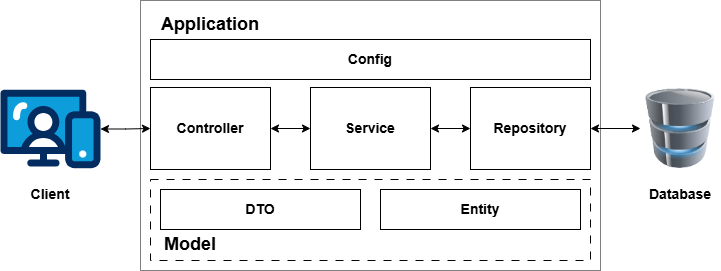

## Introducción a Spring Boot y Estructura de Proyectos

### Antes de Empezar: Preparación del Entorno

Para seguir esta clase y practicar, asegúrate de tener instalado lo siguiente:

* **Java Development Kit (JDK):** Versión 17 o superior (se recomienda una versión LTS como 17 o 21).
* **Entorno de Desarrollo Integrado (IDE):**
    * Cursor AI (si lo utilizas)
    * IntelliJ IDEA Community o Ultimate
    * VS Code con extensiones Java (Extension Pack for Java)
* **Navegador Web:** Cualquier navegador moderno (Chrome, Firefox, Edge, Safari).
* **Herramienta para probar APIs (Opcional pero Recomendado):**
    * Postman
    * Insomnia
    * O simplemente usar la línea de comandos con `curl`.

---

### 1. Bienvenida e Introducción

¡Hola a todos/as!

En esta primera clase, nos sumergiremos en el mundo de **Spring Boot**, la forma más popular y rápida de crear aplicaciones Java robustas y listas para producción.

**Objetivos de Aprendizaje de Hoy:**

Al finalizar esta sesión, serás capaz de:

* Comprender qué es Spring Boot, sus ventajas y por qué es tan utilizado.
* Generar y configurar tu primer proyecto Spring Boot.
* Entender y aplicar una estructura de carpetas profesional.
* Describir los principios básicos de las APIs REST.
* Construir y probar un endpoint REST básico que retorne datos en JSON.
* Utilizar herramientas de IA (como Cursor AI) para asistirte en tareas de desarrollo.

**Agenda del Día:**

1.  ¿Qué es Spring Boot?
2.  Creación del proyecto con Spring Initializr.
3.  Estructura recomendada de carpetas.
4.  Configuración básica (`application.properties`).
5.  Introducción a REST y creación de nuestra primera API GET.
6.  Asistencia con herramientas de IA (Cursor AI).
7.  Conclusiones y próximos pasos.

---

### 2. ¿Qué es Spring Boot y por qué usarlo?

Anteriormente, desarrollar con Java EE o incluso con el Spring Framework clásico podía ser complejo debido a la gran cantidad de configuración necesaria (XMLs, despliegue en servidores externos, gestión de dependencias manual...).

**Spring Boot** nació para simplificar drásticamente el desarrollo de aplicaciones Spring. Piensa en él como una capa por encima del Spring Framework tradicional que te permite "arrancar" (boot) rápidamente.

**Conceptos Clave de Spring Boot:**

* **"Convention over Configuration" (Convención sobre Configuración):** En lugar de forzarte a configurar todo, Spring Boot asume sensiblemente lo que necesitas basándose en las dependencias que añades. Si necesitas algo diferente, puedes sobreescribir las convenciones fácilmente.
* **Auto-configuración (Auto-configuration):** Basado en las Jars (librerías) que tienes en tu proyecto, Spring Boot configura automáticamente muchos aspectos de tu aplicación (por ejemplo, configura una base de datos si ve que tienes el driver, configura un servidor web si ve que tienes `spring-boot-starter-web`, etc.).
* **Servidores Embebidos (Embedded Servers):** No necesitas instalar y configurar un servidor de aplicaciones externo (como Tomcat, Jetty o WildFly). Spring Boot incluye servidores embebidos (Tomcat es el default con `spring-boot-starter-web`), permitiéndote empaquetar tu aplicación completa como un único archivo JAR ejecutable. Simplemente ejecutas `java -jar tu-app.jar`.
* **Starters:** Son conjuntos de dependencias pre-configuradas. Por ejemplo, `spring-boot-starter-web` incluye todo lo necesario para construir aplicaciones web y APIs REST (Spring MVC, Tomcat embebido, Jackson para JSON, etc.). Simplifican enormemente la gestión del `pom.xml` (Maven) o `build.gradle` (Gradle).
* **Actuator (Mención):** Proporciona puntos finales (endpoints) listos para usar que te permiten monitorear y gestionar tu aplicación en producción (salud, métricas, información de entorno, etc.).

**Ventajas Clave de Usar Spring Boot:**

* **Mayor Productividad:** Desarrollas más rápido gracias a la auto-configuración y los starters.
* **Ideal para Microservicios:** Su diseño JAR ejecutable y su ligereza lo hacen perfecto para construir microservicios.
* **Aprovecha el Ecosistema Spring:** Tienes acceso a todos los proyectos de Spring (Data, Security, Cloud, etc.).
* **Gran Comunidad y Documentación:** Es una tecnología madura con mucho soporte en línea.

**Comparación Breve (Alto Nivel):**

* **vs. Spring Framework Clásico:** Boot simplifica enormemente la configuración que era manual o en XML en el Spring clásico.
* **vs. Java EE/Jakarta EE:** Boot ofrece una alternativa más ligera y rápida de configurar y desplegar, sin necesidad de servidores de aplicaciones robustos.
* **vs. Otros frameworks (Node.js, Python/Django/Flask):** Spring Boot ofrece la solidez y el rendimiento de Java con una experiencia de desarrollo ágil que compite favorablemente con frameworks dinámicos, manteniendo la ventaja del tipado fuerte de Java.
* **vs. Alternativas Java Ligeras (Quarkus, Micronaut):** Estas son alternativas más recientes, a menudo optimizadas para tiempos de arranque y uso de memoria reducidos, populares en entornos serverless y microservicios. Spring Boot sigue siendo el líder del mercado por su madurez, ecosistema y facilidad de uso general.

---

### 3. Creación del Proyecto con Spring Initializr y Apertura en IDE

La forma más sencilla y recomendada de iniciar un proyecto Spring Boot es usando **Spring Initializr**, una herramienta web que genera el esqueleto básico por ti.

**Pasos para Crear el Proyecto:**

1.  Abre tu navegador y ve a: `https://start.spring.io/`
2.  **Configura tu proyecto:**
    * **Project:** Selecciona **Maven** o Gradle (usaremos Maven en la demo).
    * **Language:** Selecciona **Java**.
    * **Spring Boot Version:** Elige la **última versión estable** recomendada (normalmente la que no tiene sufijo como SNAPSHOT o M).
    * **Project Metadata:**
        * **Group:** Un identificador único para tu organización (ej: `com.midominio.curso`).
        * **Artifact:** El nombre de tu proyecto (ej: `introduccion-springboot`).
        * **Name:** Nombre legible del proyecto (suele ser igual al Artifact).
        * **Description:** Una breve descripción.
        * **Package name:** Se genera automáticamente (Group + Artifact).
        * **Packaging:** Selecciona **Jar** (para ejecutar con servidor embebido).
        * **Java:** Elige la **versión LTS** que tengas instalada (17 o 21).
    * **Dependencies:** Haz clic en "Add Dependencies..." y busca y añade **`Spring Web`**. Esta es la dependencia clave para construir aplicaciones web y APIs REST.

3.  Haz clic en el botón **Generate** (en la parte inferior). Se descargará un archivo ZIP.

4.  **Importar el Proyecto en tu IDE (Cursor AI / IntelliJ / VS Code):**
    * Descomprime el archivo ZIP descargado en una carpeta de tu elección.
    * Abre tu IDE.
    * Selecciona la opción para "Abrir" o "Importar" un proyecto existente.
    * Navega hasta la carpeta donde descomprimiste el proyecto y selecciona la carpeta raíz del proyecto (la que contiene `pom.xml`). El IDE debería reconocerlo automáticamente como un proyecto Maven.
    * Espera a que el IDE descargue las dependencias (esto puede tardar un poco la primera vez).

**Explorando el Proyecto Generado:**

* **`pom.xml` (si usaste Maven):** Este archivo define las dependencias y cómo se construye el proyecto. Busca la dependencia `spring-boot-starter-web` que añadimos.
* **`src/main/java/com/tu_paquete_base/TuAplicacionApplication.java`:** Esta es la clase principal. Contiene el método `main()` y la anotación `@SpringBootApplication`.
    * `@SpringBootApplication`: Es una anotación de conveniencia que equivale a `@Configuration`, `@EnableAutoConfiguration` y `@ComponentScan`. Básicamente, le dice a Spring Boot: "Esta es la clase principal, configura automáticamente basándote en las dependencias y escanea componentes (clases con anotaciones Spring como `@Controller`, `@Service`, etc.) dentro de este paquete y subpaquetes".

**Primera Ejecución:**

* En tu IDE, busca la clase `TuAplicacionApplication.java`.
* Haz clic derecho sobre ella y selecciona la opción para "Ejecutar" o "Run".
* Observa la consola: Deberías ver los logs de Spring Boot, indicando que está arrancando un servidor web (Tomcat) en el puerto 8080.
* Abre tu navegador y ve a `http://localhost:8080`. Verás una página de "Whitelabel Error Page". ¡Esto es esperado! Significa que el servidor web está funcionando, pero aún no tenemos ningún endpoint configurado para la raíz (`/`).
* Detén la aplicación desde el IDE.

---

### 4. Estructura Profesional de Carpetas

Mantener una estructura de carpetas organizada es crucial para la mantenibilidad, escalabilidad y colaboración en un proyecto de software. En Spring Boot, una estructura común sigue el patrón de **arquitectura por capas**.

**Importancia de la Estructura:**

* **Separación de Responsabilidades:** Cada capa tiene un rol específico, lo que hace el código más fácil de entender y modificar.
* **Mantenibilidad:** Es más sencillo encontrar y arreglar errores o añadir nuevas funcionalidades.
* **Escalabilidad:** Permite escalar componentes específicos de forma independiente.
* **Colaboración:** Facilita que varios desarrolladores trabajen en diferentes partes del proyecto sin conflictos.

**Modelo de Capas Común (Simplificado):**

El flujo típico de una petición sería:

`Cliente (Navegador/App) -> Controller -> Service -> Repository -> Base de Datos`



**Descripción de Paquetes (Carpetas) Principales:**

Dentro de tu paquete base (ej: `com.midominio.curso.introduccion`), crea los siguientes subpaquetes:

* `controller` (o `web`, `api`):
    * Contiene las clases que manejan las peticiones HTTP entrantes.
    * Usan anotaciones como `@RestController`.
    * Son la "puerta de entrada" a la aplicación desde el exterior.
    * Su responsabilidad principal es recibir la petición, delegarla a la capa de servicio y formatear la respuesta (a JSON, XML, etc.).
* `service`:
    * Contiene la **lógica de negocio principal** de la aplicación.
    * Coordina operaciones que pueden involucrar múltiples repositorios o validaciones complejas.
    * Debe ser independiente de la capa de presentación (controller) y la capa de datos (repository).
* `repository` (o `dao` - Data Access Object):
    * Contiene las clases o interfaces responsables de interactuar directamente con la fuente de datos (base de datos, sistema de archivos, otro servicio...).
    * En Spring Boot, a menudo usamos Spring Data JPA para esto, definiendo interfaces que Spring implementa automáticamente.
* `model` (o `domain`, `entity`):
    * Contiene las clases POJO (Plain Old Java Object) que representan los datos de tu aplicación.
    * Puede incluir Entidades (`@Entity` para JPA), DTOs (Data Transfer Objects para la comunicación entre capas o con el cliente), etc.
* `config`:
    * Contiene clases de configuración (`@Configuration`).
    * Aquí se definen Beans, configuraciones de seguridad, fuentes de datos personalizadas, etc.

**Práctica en el IDE:**

* En la vista de "Project" de tu IDE, expande `src/main/java/com/tu_paquete_base`.
* Haz clic derecho sobre tu paquete base y selecciona `New` -> `Package`.
* Crea los paquetes `controller`, `service`, `repository`, `model`, `config`.

Tu estructura de paquetes ahora debería verse algo así:
```plain
src
└── main
    └── java
        └── com
            └── midominio
                └── curso
                    └── introduccion
                        ├── config
                        ├── controller
                        ├── model
                        ├── repository
                        ├── service
                        └── IntroduccionSpringbootApplication.java // Tu clase principal
```

---

### 5. Configuración Básica: `application.properties` 

Spring Boot utiliza un archivo de configuración principal llamado `application.properties` (o `application.yml`) para definir diversas propiedades de la aplicación.

* **Ubicación:** `src/main/resources/application.properties`.
* **Propósito:** Configurar aspectos como el puerto del servidor, conexión a bases de datos, niveles de logging, propiedades específicas de Spring, y tus propias propiedades personalizadas.

**DEMO: Cambiando el Puerto del Servidor**

1.  Abre el archivo `src/main/resources/application.properties`.
2.  Añade la siguiente línea:

    ```properties
    server.port=8081
    ```

3.  Guarda el archivo.
4.  Ejecuta la aplicación principal (`TuAplicacionApplication.java`) de nuevo.
5.  Observa la consola: Ahora debería indicar que Tomcat está arrancando en el puerto **8081**.
6.  Intenta acceder a `http://localhost:8080` (dará error) y luego a `http://localhost:8081` (verás la página de error Whitelabel).
7.  Detén la aplicación.

Otras propiedades comunes que podrías añadir aquí:

* `spring.application.name=IntroduccionSpringBoot` (Define el nombre de la aplicación, útil para logging y monitoreo).
* Propiedades de base de datos (que veremos en futuras clases).

---

### 6. Servicios REST y Primera API con Spring Boot

La creación de APIs RESTful es una de las tareas más comunes con Spring Boot.

**¿Qué son los Servicios REST?**

**REST** significa **RE**presentational **S**tate **T**ransfer. Es un **estilo arquitectónico** (no un protocolo como HTTP) para diseñar sistemas distribuidos, particularmente servicios web. Se basa en principios que lo hacen simple, escalable e interoperable.

**Principios Clave de REST (Simplificado):**

1.  **Cliente-Servidor:** Clara separación de responsabilidades. El cliente (ej: navegador, aplicación móvil) se encarga de la interfaz de usuario, el servidor maneja la lógica de negocio y el almacenamiento de datos. Se comunican sin compartir estado de la sesión.
2.  **Sin Estado (Stateless):** **¡Importante!** Cada petición del cliente al servidor debe contener toda la información necesaria para que el servidor la entienda y procese. El servidor NO debe guardar información sobre la sesión del cliente entre peticiones.
    * *Ventaja:* Hace que el servidor sea más escalable (más servidores pueden manejar peticiones sin preocuparse por el estado de sesión) y resiliente (si un servidor falla, otro puede tomar la siguiente petición).
3.  **Cacheable:** Las respuestas pueden indicar si pueden ser cacheadas por el cliente para mejorar el rendimiento.
4.  **Interfaz Uniforme:** Este es el principio fundamental que distingue a REST. Implica:
    * **Recursos (Resources):** Todo lo que quieras exponer (usuarios, productos, pedidos) debe identificarse de forma única mediante **URIs** (Uniform Resource Identifiers), que son URLs. Debes usar **sustantivos** en tus URIs (ej: `/productos`, `/usuarios/123`).
    * **Verbos HTTP (Standard Methods):** Utilizas los métodos estándar del protocolo HTTP para realizar operaciones sobre los recursos. Los principales son:
        * `GET`: **Leer** un recurso o una colección de recursos. Debe ser **seguro** (no modificar el estado en el servidor) e **idempotente** (hacer la misma petición múltiples veces tiene el mismo efecto que hacerla una sola vez).
        * `POST`: **Crear** un nuevo recurso o realizar una acción. No es seguro ni idempotente.
        * `PUT`: **Reemplazar** o **actualizar completamente** un recurso existente. Es idempotente.
        * `DELETE`: **Eliminar** un recurso. Es idempotente.
        * `PATCH`: **Actualizar parcialmente** un recurso (menos común al principio).
    * **Representaciones:** Los datos se transfieren en formatos estandarizados. **JSON** (JavaScript Object Notation) es el formato más común hoy en día, aunque también se puede usar XML u otros. El cliente y el servidor acuerdan el formato usando encabezados HTTP (`Content-Type`, `Accept`).
    * **Mensajes Autodescriptivos:** Las peticiones y respuestas contienen metadatos (encabezados HTTP) que describen cómo procesar la información (`Content-Type: application/json`).
5.  **Sistema en Capas (Layered System):** Permite que la comunicación pase por intermediarios (proxies, gateways, balanceadores de carga) sin que cliente y servidor lo sepan directamente.

**Beneficios de REST:** Simplicidad, Interoperabilidad (cualquier cliente que entienda HTTP y JSON puede interactuar), Escalabilidad.

**Anotaciones Clave en Spring Boot para REST:**

Spring Boot, a través de Spring MVC, proporciona anotaciones muy útiles para construir APIs REST:

* `@RestController`: Se aplica a una clase. Es una anotación de conveniencia que combina `@Controller` y `@ResponseBody`. `@Controller` marca la clase como un manejador de peticiones web, y `@ResponseBody` indica que el valor de retorno de los métodos debe ser escrito directamente en el cuerpo de la respuesta HTTP (Spring Boot usará un convertidor, como Jackson para JSON, por defecto).
* `@GetMapping`, `@PostMapping`, `@PutMapping`, `@DeleteMapping`, `@PatchMapping`: Se aplican a métodos dentro de un `@RestController`. Mapean la ruta URL y el verbo HTTP específico a ese método Java.

**DEMO EN VIVO: Creando nuestro Primer Endpoint**

Vamos a crear un simple endpoint que responda a una petición GET en la ruta `/saludo` y retorne un mensaje en JSON.

1.  En el paquete `controller` que creaste, crea una nueva clase Java llamada `SaludoController`.
2.  Añade el siguiente código:

    ```java
    package com.midominio.curso.introduccion.controller;

    import org.springframework.web.bind.annotation.GetMapping;
    import org.springframework.web.bind.annotation.RestController;
    import java.util.Map; 
    
    // 1. Indica que esta clase es un controlador que manejará peticiones REST
    @RestController
    public class SaludoController {

        // 2. Mapea las peticiones HTTP GET que lleguen a la ruta "/saludo" a este método
        @GetMapping("/saludo")
        public Map<String, String> obtenerSaludo() {
            // 3. Creamos un Map simple. Spring Boot, gracias a la dependencia
            //    Spring Web (que incluye Jackson), convertirá este Map
            //    a una respuesta JSON automáticamente: {"mensaje": "..."}
            return Map.of("mensaje", "¡Hola REST desde Spring Boot!");
        }
    }
    ```

**Explicación del Código:**

1.  `@RestController`: Le dice a Spring que esta clase manejará peticiones web y que sus métodos retornarán datos directamente (serializados, por defecto a JSON).
2.  `@GetMapping("/saludo")`: Anota el método `obtenerSaludo()`. Le dice a Spring que este método debe ejecutarse cuando se reciba una petición HTTP **GET** en la ruta `/saludo`.
3.  `public Map<String, String> obtenerSaludo()`: El método Java que se ejecutará. Retorna un `Map` de Strings.
4.  `return Map.of("mensaje", "¡Hola REST desde Spring Boot!");`: Crea un `Map` simple. Cuando Spring ve que un método de `@RestController` retorna un objeto (como este Map) y no una vista, utiliza un convertidor de mensajes HTTP. Como tenemos `spring-boot-starter-web` (que incluye la librería Jackson), Spring Boot por defecto serializará este `Map` al formato **JSON**. El Map `{"mensaje": "¡Hola REST desde Spring Boot!"}` se convertirá en el JSON:

    ```json
    {
      "mensaje": "¡Hola REST desde Spring Boot!"
    }
    ```

**Ejecutar y Probar:**

1.  Ejecuta de nuevo la aplicación principal (`TuAplicacionApplication.java`) desde tu IDE. Asegúrate de que arranca en el puerto `8081` (si lo cambiaste antes).
2.  Abre tu navegador y ve a la URL: `http://localhost:8081/saludo` (o `http://localhost:8080/saludo` si no cambiaste el puerto).
3.  Deberías ver la respuesta JSON directamente en el navegador (muchos navegadores formatean el JSON).
4.  **Alternativa con `curl`:** Abre tu terminal o línea de comandos y ejecuta:

    ```bash
    curl http://localhost:8081/saludo
    ```

    Verás la respuesta JSON en la consola. Para ver los encabezados HTTP, usa:

    ```bash
    curl -i http://localhost:8081/saludo
    ```

    Fíjate en el encabezado `Content-Type: application/json`. Esto confirma que Spring Boot está respondiendo con JSON.
5.  Detén la aplicación.

¡Felicidades! Acabas de crear y probar tu primer endpoint RESTful con Spring Boot.

---

### 7. Uso de Herramientas de IA para Asistencia 

Herramientas como Cursor AI, o asistentes generales de IA, pueden ser muy útiles para acelerar ciertas tareas y comprender código.

**Cómo Usarlas (Ejemplos con Cursor AI/Similar):**

* **Generar Documentación (Javadoc):**
    * Coloca el cursor sobre una clase o método (ej: `SaludoController` o `obtenerSaludo`).
    * Usa la función de AI para generar Javadoc (en Cursor AI, suele haber un comando o botón específico). Esto crea comentarios estándar explicando la clase/método, parámetros y retorno. **Siempre revisa y ajusta el Javadoc generado.**
* **Explicar Código:**
    * Selecciona una parte del código (ej: `@RestController` o el método `obtenerSaludo`).
    * Usa la función de AI para que te explique qué hace esa parte del código. Esto es genial para entender anotaciones o fragmentos desconocidos.
* **Generar Esqueletos de Código (Con precaución):**
    * Puedes pedirle a la IA que genere el esqueleto de un método para un endpoint POST, por ejemplo.
    * *Ejemplo de Prompt:* "Genera un método en esta clase SaludoController para manejar peticiones POST en /saludo que reciba un String en el cuerpo de la petición."
    * **Importante:** El código generado por IA es un *punto de partida*. No lo copies y pegues sin entenderlo completamente y adaptarlo a tus necesidades. La IA puede cometer errores o sugerir prácticas no óptimas.

**Ventajas:** Aceleran tareas repetitivas (como documentación), ayudan a entender conceptos rápidamente.
**Precauciones:** La IA puede equivocarse. Siempre verifica, entiende y adapta el código. No dejes que sustituya tu propio aprendizaje y comprensión.

---

### 8. Conclusiones, Q&A y Próximos Pasos

**Resumen Rápido de lo Cubierto:**

* Entendimos qué es Spring Boot y sus ventajas (auto-configuración, starters, servidores embebidos).
* Creamos un proyecto desde cero con Spring Initializr.
* Definimos una estructura de paquetes por capas.
* Vimos cómo configurar propiedades básicas en `application.properties`.
* Aprendimos los principios básicos de las APIs REST (recursos, verbos, JSON).
* Construimos y probamos nuestro primer endpoint GET usando `@RestController` y `@GetMapping`.
* Exploramos cómo usar herramientas de IA para asistencia.

**¿Cumplimos los Objetivos?** ¡Sí! Hemos sentado las bases para construir aplicaciones con Spring Boot y APIs REST.

**Preguntas y Respuestas:** ¡Es vuestro turno! No dudéis en preguntar cualquier duda que tengáis.

**Próximos Pasos Sugeridos para Seguir Aprendiendo:**

* Implementar las otras capas: Añadir clases en `service` y `repository`.
* Spring Data JPA: Conectar la aplicación a una base de datos (ej: H2 en memoria para empezar, o PostgreSQL).
* Implementar otros verbos HTTP: Crear endpoints POST, PUT, DELETE.
* Validación: Validar los datos de entrada en las peticiones.
* Manejo de Errores: Implementar estrategias para dar respuestas útiles en caso de errores.
* Testing: Escribir pruebas unitarias e de integración para tu API.

**Recursos Útiles:**

* **Documentación Oficial de Spring Boot:** [https://docs.spring.io/spring-boot/docs/current/reference/html/](https://docs.spring.io/spring-boot/docs/current/reference/html/) (¡La fuente principal!)
* **Spring Guides:** [https://spring.io/guides](https://spring.io/guides) (Tutoriales paso a paso sobre temas específicos).
* **Baeldung:** [https://www.baeldung.com/](https://www.baeldung.com/) (Uno de los sitios más populares con excelentes tutoriales de Spring y Java).
