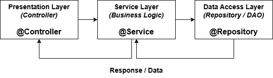

# Servicios y Lógica de Negocio con Spring

¡Hola! En esta clase, vamos a organizar y mejorar la forma en que manejamos la lógica de negocio en nuestras aplicaciones Spring. Aprenderemos a separar las responsabilidades de manera efectiva y a construir servicios robustos, ¡siempre con la ayuda de nuestro editor **Cursor AI**!

---

## 1. ¿Por Qué una Capa de Servicio? Introducción y Contexto

### El Problema: Lógica de Negocio en el Controlador

En el patrón Model-View-Controller (MVC), los controladores se encargan de recibir las peticiones del usuario, interactuar con el modelo y seleccionar la vista adecuada. Son la puerta de entrada a nuestra aplicación.

Sin embargo, si ponemos toda la lógica de negocio (reglas, cálculos, validaciones complejas, coordinación de acciones) directamente en los controladores, estos se vuelven:

* **Voluminosos y difíciles de leer:** Acumulan demasiadas responsabilidades.
* **Difíciles de mantener:** Un cambio en la lógica de negocio afecta directamente a la capa de presentación.
* **Difíciles de probar:** Probar la lógica de negocio requiere levantar todo el contexto web del controlador.
* **Poco reutilizables:** La misma lógica no puede ser fácilmente invocada desde otras partes de la aplicación (ej. una tarea programada, una API interna).

### La Solución: El Patrón Service Layer

El patrón Service Layer (Capa de Servicio) introduce una capa intermedia entre la capa de presentación (controladores) y la capa de acceso a datos (repositorios). Su propósito principal es encapsular la lógica de negocio.

**El Service Layer es donde reside la "inteligencia" de tu aplicación.**

**Beneficios Clave:**

* **Separación de Responsabilidades:** Los controladores se enfocan solo en manejar peticiones y respuestas HTTP. Los servicios se enfocan en *qué* hacer con los datos y *cómo* realizar las operaciones de negocio.
* **Mayor Cohesión:** Cada clase (controlador, servicio, repositorio) tiene una responsabilidad clara y única.
* **Menor Acoplamiento:** Los controladores dependen de interfaces de servicio, no de implementaciones concretas o lógica detallada. Esto facilita cambiar implementaciones o probar componentes de forma aislada.
* **Reutilización:** La lógica de negocio en los servicios puede ser invocada por múltiples controladores u otros componentes de la aplicación.
* **Mantenibilidad:** Los cambios en la lógica de negocio se localizan principalmente en la capa de servicio, reduciendo el riesgo de efectos secundarios inesperados en otras partes.
* **Testabilidad:** Los servicios pueden ser probados fácilmente de forma unitaria, sin necesidad de configurar un entorno web o de base de datos completo.

---

## 2. Inversión de Dependencias con Spring

### Inversión de Control (IoC) y Inyección de Dependencias (DI)

Spring se basa fuertemente en los principios de Inversión de Control (IoC) y su implementación más común, la Inyección de Dependencias (DI).

* **IoC:** En lugar de que un objeto cree o gestione directamente sus dependencias, un contenedor (el contenedor de Spring) se encarga de crearlas y proporcionárselas al objeto cuando las necesita. Se "invierte" el control sobre la gestión de dependencias.
* **DI:** Es el mecanismo específico para lograr IoC. Las dependencias (otros objetos que una clase necesita para funcionar) son "inyectadas" en la clase, generalmente a través de constructores, métodos `setter` o campos.

El **Contenedor de IoC de Spring** es el corazón del framework. Es responsable de:

1.  Instanciar los beans (los objetos gestionados por Spring).
2.  Configurar los beans.
3.  Gestionar el ciclo de vida de los beans.
4.  Inyectar las dependencias entre beans.

### Anotaciones Clave: `@Service` y `@Autowired`

Spring proporciona anotaciones para simplificar la configuración de IoC y DI:

* `@Service`: Es una anotación estereotipo (una anotación que marca la función o rol de una clase) que indica que una clase es un **componente de la capa de servicio**. Spring detectará automáticamente estas clases durante el escaneo de componentes y creará un bean de ellas en su contenedor. Semánticamente, la usamos para clases que contienen lógica de negocio.

    ```java
    @Service
    public class MyBusinessService {
        // Lógica de negocio aquí
    }
    ```

* `@Autowired`: Esta anotación se utiliza para **inyectar dependencias**. Spring buscará un bean compatible en su contenedor y lo asignará automáticamente al campo, constructor o método `setter` anotado.

    ```java
    @Service
    public class AnotherService {

        private final MyBusinessService myBusinessService;

        @Autowired // Inyección por constructor (método recomendado)
        public AnotherService(MyBusinessService myBusinessService) {
            this.myBusinessService = myBusinessService;
        }

        public void performAction() {
            myBusinessService.doSomething();
        }
    }
    ```

    La inyección por constructor (`@Autowired` en el constructor) es generalmente preferible ya que asegura que el objeto tenga todas sus dependencias al ser creado y facilita la prueba unitaria.

**Cómo te ayuda Cursor AI aquí:**

* **Autocompletación:** **Cursor AI** te ofrecerá rápidamente las anotaciones `@Service` y `@Autowired` mientras escribes.
* **Generación de Código:** Puedes usar la generación de código (Cmd/Ctrl + K) o prompts en el chat para pedir a **Cursor AI** que te cree la estructura básica de una clase `@Service` con una dependencia inyectada. Por ejemplo: "Create a Spring Service class named ProductService with a dependency on ProductRepository".
* **Explicaciones:** Si olvidas qué hace una anotación o cómo funciona la inyección, puedes seleccionar el código o escribir en el chat de **Cursor AI** (Cmd/Ctrl + L) preguntas como: "¿Qué hace @Autowired?", "Explain Spring Dependency Injection".

---

## 3. Separación por Capas: Profundizando en el Patrón Service Layer

Como mencionamos, el patrón Service Layer es una de las capas en la arquitectura de aplicaciones Spring:

* **Capa de Presentación:** Maneja la interacción con el usuario (controladores REST, controladores MVC para vistas, etc.). Su trabajo es recibir la entrada, validar datos básicos, pasar la solicitud a la capa de servicio y devolver una respuesta. **(Ej: Clases con `@RestController` o `@Controller`)**
* **Capa de Servicio (Business Logic):** Contiene las reglas de negocio, coordina las operaciones de acceso a datos si es necesario, realiza validaciones complejas y define las transacciones. No interactúa directamente con la base de datos o fuentes de datos externas; delega esta tarea a la capa de acceso a datos. **(Ej: Clases con `@Service`)**
* **Capa de Acceso a Datos (Data Access Object - DAO / Repository):** Es responsable de la comunicación directa con la fuente de datos (bases de datos, servicios externos, etc.). Proporciona métodos para realizar operaciones CRUD básicas sobre las entidades (guardar, leer, actualizar, eliminar). **(Ej: Interfaces que extienden `JpaRepository` o clases con `@Repository`)**



El Service Layer actúa como el **orquestador**. Un método en un servicio podría:

1.  Recibir datos de un controlador.
2.  Validar esos datos según reglas de negocio.
3.  Invocar uno o varios métodos de diferentes repositorios para obtener o guardar información.
4.  Realizar cálculos o transformaciones complejas con los datos.
5.  Manejar la lógica transaccional.
6.  Devolver un resultado al controlador.

**Cómo te ayuda Cursor AI aquí:**

* **Navegación y Búsqueda:** Utiliza las capacidades de navegación y búsqueda semántica de **Cursor AI** para moverte rápidamente entre controladores, servicios y repositorios en tu proyecto, ayudándote a visualizar la estructura en capas.
* **Diagramas Conceptuales (Potencial):** Aunque no es una función nativa de diagramación, a veces puedes pedir a **Cursor AI** en el chat que te describa la interacción entre capas para un escenario específico, ayudando a solidificar tu comprensión.

---

## 4. Otras Anotaciones de Componentes de Spring

Además de `@Service`, Spring ofrece otras anotaciones estereotipo y de configuración importantes:

* `@Component`: Esta es la anotación estereotipo genérica. Cualquier clase anotada con `@Component` es candidata a ser gestionada como un bean por el contenedor de Spring. `@Service`, `@Repository` y `@Controller` son especializaciones de `@Component` que añaden semántica (significado) a la clase.

    ```java
    @Component
    public class UtilityClass {
        // Métodos de utilidad general
    }
    ```
    Aunque puedes usar `@Component` para servicios, es mejor usar `@Service` porque comunica más claramente el rol de la clase.

* `@Repository`: Anotación estereotipo para clases que actúan como **repositorios de datos** o DAOs (Data Access Objects). Indica que la clase tiene el rol de interactuar con la base de datos. Spring puede aplicar funcionalidades especiales a estas clases (como traducción automática de excepciones de base de datos).

    ```java
    @Repository
    public interface ProductRepository extends JpaRepository<Product, Long> {
        // Métodos para acceder a datos de productos
    }
    ```

* `@Controller`: Anotación estereotipo para clases que actúan como **controladores en la capa de presentación**, manejando peticiones web.

    ```java
    @Controller // Para MVC tradicional que devuelve vistas
    public class HomeController {
        // Maneja peticiones web
    }

    @RestController // Combinación de @Controller y @ResponseBody para APIs REST
    public class ProductController {
       // Maneja peticiones REST y devuelve datos directamente
    }
    ```

* `@Configuration` y `@Bean`: Estas anotaciones se utilizan para definir beans de Spring usando configuración basada en Java en lugar de escaneo de componentes.
    * `@Configuration`: Indica que una clase declara uno o más métodos `@Bean`. Spring procesará esta clase para generar beans.
    * `@Bean`: Se usa en un método dentro de una clase `@Configuration`. El método debe retornar un objeto que Spring registrará como un bean en su contenedor. El nombre del bean por defecto será el nombre del método.

    ```java
    @Configuration
    public class AppConfig {

        @Bean // Define un bean llamado 'myCustomBean'
        public MyCustomClass myCustomBean() {
            return new MyCustomClass();
        }

        @Bean // Define otro bean llamado 'anotherDependency'
        public AnotherDependency anotherDependency() {
            // Aquí puedes configurar la dependencia si es necesario
            return new AnotherDependency();
        }

        // Puedes inyectar otros beans de configuración en métodos @Bean
        @Bean
        public ServiceWithDependency myServiceWithDependency(@Autowired AnotherDependency anotherDependency) {
             return new ServiceWithDependency(anotherDependency);
        }
    }
    ```
    Usas `@Configuration` y `@Bean` principalmente cuando necesitas crear beans de clases de terceros (que no puedes anotar con `@Component`), o cuando necesitas lógica compleja para crear o configurar un bean.

**Cómo te ayuda Cursor AI aquí:**

* **Generación de Ejemplos:** Pide a **Cursor AI** en el chat que te genere ejemplos de código para cada una de estas anotaciones.
* **Comparativas:** Pregúntale a **Cursor AI** la diferencia entre `@Component` y `@Service` o entre `@Service` y `@Bean` en un contexto específico.
* **Explicación de Código:** Selecciona un bloque de código con estas anotaciones y pídele a **Cursor AI** (Cmd/Ctrl + L) que te lo explique.

---

## 5. Implementando el Servicio LibroService con Cursor AI

Ahora, vamos a aplicar estos conceptos creando un servicio real para gestionar libros.

Nuestro `LibroService` encapsulará la lógica de negocio relacionada con los libros. Para simplificar, usaremos una `List` en memoria para almacenar los datos, simulando una fuente de datos temporal.

Primero, definiremos una clase simple `Libro`:

```java
public class Libro {
    private String isbn;
    private String titulo;
    private String autor;
    // Constructor, getters y setters
    // ... (puedes usar la generación de código de Cursor AI para esto)
}
```

_(Consejo: Usa Cursor AI para generar automáticamente el constructor, getters, setters, `equals()` y `hashCode()` para la clase `Libro`.)_

Luego, crearemos la interfaz `LibroService` (opcional, pero recomendado para desacoplamiento y testabilidad):

```java
import java.util.List;

public interface LibroService {
    List<Libro> listarLibros();
    Libro buscarPorTitulo(String titulo);
    void agregarLibro(Libro libro);
    void eliminarLibro(String titulo); // Simplificamos buscando por título
}
```

Y la implementación de nuestro servicio, anotada con `@Service` para que Spring la gestione:

```java
import org.springframework.stereotype.Service;
import java.util.ArrayList;
import java.util.List;
import java.util.Optional; // Para manejar el resultado de la búsqueda

@Service
public class LibroServiceImpl implements LibroService {

    private final List<Libro> listaLibros = new ArrayList<>(); // Nuestra "base de datos" en memoria

    @Override
    public List<Libro> listarLibros() {
        // Lógica para listar
        return new ArrayList<>(listaLibros); // Devolver una copia para evitar modificaciones externas
    }

    @Override
    public Libro buscarPorTitulo(String titulo) {
        // Lógica para buscar
        Optional<Libro> found = listaLibros.stream()
                                          .filter(libro -> libro.getTitulo().equalsIgnoreCase(titulo))
                                          .findFirst();
        return found.orElse(null); // Devuelve el libro si lo encuentra, null si no
    }

    @Override
    public void agregarLibro(Libro libro) {
        // Lógica para agregar
        if (libro != null && buscarPorTitulo(libro.getTitulo()) == null) { // Simple validación: no duplicados por título
            listaLibros.add(libro);
        }
    }

    @Override
    public void eliminarLibro(String titulo) {
        // Lógica para eliminar
        listaLibros.removeIf(libro -> libro.getTitulo().equalsIgnoreCase(titulo));
    }
}
```

Finalmente, inyectaremos este servicio en un controlador simple para poder invocar sus métodos desde peticiones HTTP:

```java
import org.springframework.beans.factory.annotation.Autowired;
import org.springframework.web.bind.annotation.*;

import java.util.List;

@RestController // O @Controller con @ResponseBody
@RequestMapping("/api/libros")
public class LibroController {

    private final LibroService libroService;

    @Autowired
    public LibroController(LibroService libroService) {
        this.libroService = libroService;
    }

    @GetMapping
    public List<Libro> getAllLibros() {
        return libroService.listarLibros();
    }

    @GetMapping("/{titulo}")
    public Libro getLibroByTitulo(@PathVariable String titulo) {
        return libroService.buscarPorTitulo(titulo);
    }

    @PostMapping
    public void addLibro(@RequestBody Libro libro) {
        libroService.agregarLibro(libro);
    }

    @DeleteMapping("/{titulo}")
    public void deleteLibro(@PathVariable String titulo) {
        libroService.eliminarLibro(titulo);
    }
}
```

**Cómo te ayuda Cursor AI en esta implementación**:

* **Generación de Esqueletos**: Usa Cmd/Ctrl + K para generar rápidamente los métodos de la interfaz `LibroService` en la clase `LibroServiceImpl`.
* **Completado de Código**: Cursor AI te sugerirá la lógica para operaciones comunes como filtrar una lista (`stream().filter()...`) o añadir elementos.
* **Explicaciones de Código Java**: Si no entiendes alguna parte de la sintaxis (como `stream`, `Optional`, `removeIf`), selecciona el código y pídele a Cursor AI que te lo explique.
* **Ayuda con Errores**: Si cometes un error de sintaxis o lógico, Cursor AI a menudo puede sugerir correcciones.
* **Inyección en el Controlador**: Al crear el constructor en `LibroController`, Cursor AI probablemente te sugerirá automáticamente inyectar `LibroService`.

---

## 6. Refactorización y Mejora del Código con Cursor AI

Una vez que nuestro código funciona, es importante mejorarlo para que sea más legible, mantenible y eficiente. Este proceso se llama **refactorización**. Refactorizar es cambiar la estructura interna del código sin alterar su comportamiento externo.

**Escenarios Comunes de Refactorización en Servicios:**

* **Extraer Métodos**: Si un método se vuelve muy largo o realiza varias tareas, puedes extraer partes de su lógica en métodos privados más pequeños y con nombres descriptivos.
* **Renombrar**: Cambiar nombres de variables, métodos o clases para que sean más claros y reflejen mejor su propósito.
* **Simplificar Expresiones**: Hacer que condiciones o cálculos complejos sean más fáciles de entender.
* **Eliminar Código Duplicado**: Identificar y consolidar bloques de código idénticos o muy similares.

**Refactorización Asistida por AI con Cursor AI:**

Cursor AI puede ser un compañero muy potente en este proceso. No solo realiza refactorizaciones automáticas básicas (como renombrar en todo el proyecto), sino que también puede sugerir refactorizaciones más complejas basándose en el análisis del código y las mejores prácticas.

**Cómo usar Cursor AI para refactorizar:**

1. **Selecciona el Código:** Resalta el bloque de código que quieres refactorizar o mejorar.
1. **Usa el Chat o Comandos AI:**
    * Abre el chat de AI (Cmd/Ctrl + L) y pídele a Cursor AI que refactorice el código seleccionado. Puedes ser específico, por ejemplo: "Refactor this method to extract the validation logic into a separate private method", o "Simplify this conditional statement".
    * Busca comandos de refactorización específicos en la paleta de comandos o menús contextuales que puedan ser asistidos por AI ("Suggest Refactoring").
    * Utiliza la función de Renombrar (Shift + F6). Cursor AI es consciente del contexto y puede hacer sugerencias de nombres más relevantes.
1. **Revisa la Sugerencia:** Cursor AI te presentará el código refactorizado propuesto.
1. **Evalúa y Aplica:** **¡Paso CRUCIAL!** No apliques automáticamente la sugerencia de la IA. Revisa cuidadosamente los cambios, asegúrate de que entiendes por qué se hicieron y verifica que el comportamiento del código no ha cambiado. Si estás satisfecho, aplica los cambios.

**Recuerda**: La IA es una herramienta. Tú sigues siendo el arquitecto y el responsable final de la calidad y corrección del código.

## 7. Conclusiones
Hemos visto cómo el patrón Service Layer es esencial para construir aplicaciones Spring bien estructuradas y mantenibles. Separar la lógica de negocio en servicios dedicados mejora la organización, la reutilización y la testabilidad.

Dominar el uso de anotaciones como `@Service`, `@Autowired`, `@Component`, `@Bean`, y `@Configuration` es fundamental para trabajar con el contenedor de IoC de Spring.

Finalmente, herramientas modernas como Cursor AI no solo facilitan la escritura de código con autocompletación y generación, sino que también nos asisten activamente en la comprensión de conceptos y en la mejora continua de nuestro código a través de la refactorización inteligente. ¡Aprovechen estas capacidades para ser desarrolladores más eficientes y productivos!

---

Si tienen alguna pregunta durante la clase, no duden en interrumpir o usar el chat de Cursor AI para buscar respuestas rápidas o explicaciones adicionales.

¡Manos a la obra!
