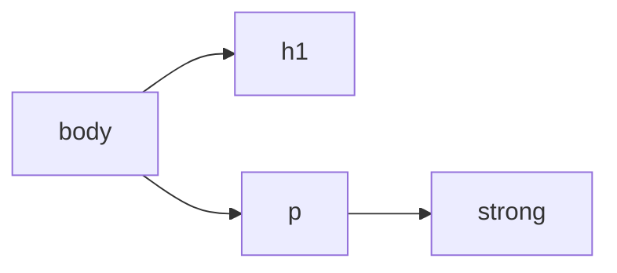

# Módulo 2: HTML5 - El Esqueleto de la Web

En el Módulo 1, establecimos los conceptos clave: HTML es la **estructura**, CSS es la **presentación** y JavaScript es la **interacción**.

En este módulo, nos arremangamos y nos enfocamos 100% en el **HTML**. Vamos a dejar la teoría abstracta y a escribir nuestra primera página web real. Al final de este módulo, tendrás un archivo `index.html` que representa la estructura de una página de perfil.

No te preocupes por los colores, las fuentes o el diseño todavía. De hecho, nuestra página se verá "fea" (muy simple, texto negro sobre fondo blanco), y eso es **perfecto**. Significa que estamos separando correctamente las responsabilidades. Este paso es fundamental: no podemos pintar una pared (CSS) si primero no hemos construido el muro (HTML).

## 1. La Sintaxis Básica de HTML

HTML no es un lenguaje de programación (no tiene lógica), es un **lenguaje de marcado**. Su trabajo no es "calcular" o "decidir", sino "describir" y "estructurar". Funciona dándole instrucciones al navegador (un programa que no es humano y necesita instrucciones muy claras) usando "etiquetas" (o tags).

### a. Elementos (Tags)

Los elementos son la unidad de construcción fundamental. Le dicen al navegador qué tipo de contenido está mostrando, dándole un **significado semántico**.

La mayoría de los elementos tienen una etiqueta de apertura y una etiqueta de cierre. La combinación de la etiqueta de apertura, el contenido y la etiqueta de cierre forma un **elemento HTML**.

```html
<p>Esto es un párrafo.</p>
<h1>Esto es un título principal.</h1>
<em>Esto es un texto enfatizado (cursiva).</em>
<strong>Esto es un texto importante (negrita).</strong>
```

- `<p>` es la etiqueta de apertura (indica que "aquí comienza un párrafo").
- `</p>` es la etiqueta de cierre (indica que "aquí termina el párrafo").
- `<em>` (énfasis) y `<strong>` (importancia) son elementos "en línea" (inline), ya que viven dentro de otros elementos como los párrafos.

**Elementos Auto-cerrados (Empty Elements)**: Algunos elementos no tienen contenido interno, por lo que no necesitan una etiqueta de cierre. Simplemente "son" una cosa. Se cierran solos. Los más comunes son:

- `` (para insertar una imagen)
- `<br>` (para un salto de línea simple, úsalo con moderación)
- `<hr>` (para una "línea horizontal" o separación temática)
- `<link>` (para vincular archivos CSS, lo veremos pronto)

### b. Atributos

Los atributos son información **adicional** (configuraciones o ajustes) que proporcionamos a un elemento para modificar su comportamiento o darle más información.

- Siempre se escriben en la **etiqueta de apertura**.
- Generalmente vienen en pares `nombre="valor"`. Los valores casi siempre deben ir entre comillas (dobles o simples).

```html
<a href="[https://www.google.com](https://www.google.com)" target="_blank">Ir a Google</a>
```

- **Elemento**: `<a>` (un ancla, o hipervínculo).
- **Atributo 1**: `href` (hyperlink reference).
- **Valor 1**: `"https://www.google.com"` (el destino del enlace).
- **Atributo 2**: `target` (dónde abrir el enlace).
- **Valor 2**: `"_blank"` (un valor especial que significa "abrir en una nueva pestaña"). Esto es excelente para enlaces externos, ya que no saca al usuario de tu sitio.

```html

```

- **Elemento**: ``.
- **Atributo 1**: `src` (source). Le dice al navegador _dónde_ encontrar el archivo de la imagen (la ruta).
- **Atributo 2**: `alt` (alternative text). Es **crucial para la accesibilidad**. Describe la imagen para lectores de pantalla (personas con discapacidad visual) y también se muestra si la imagen no puede cargar.

**Atributos clave que debes conocer (aunque los usaremos más con CSS y JS)**:

- `id`: Un identificador **único** para un elemento. No puede haber dos elementos con el mismo `id` en una página. Se usa para apuntar a un elemento muy específico.

  ```html
  <div id="menu-principal">...</div>
  ```

- `class`: Un identificador **reutilizable**. _Muchos_ elementos pueden compartir la misma clase. Es la forma más común de agrupar elementos para darles el mismo estilo CSS.

  ```html
  <p class="noticia-destacada">...</p>

  <p class="noticia-destacada">...</p>
  ```

### c. Anidamiento (Nesting)

El anidamiento es simplemente poner elementos dentro de otros elementos. Así es como construimos la jerarquía o "árbol" del DOM (Document Object Model). El navegador lee esta estructura anidada para entender la relación entre los elementos.

```html
<body> <!-- Padre -->
    <h1>Mi Título</h1> <!-- Hijo de body -->
    <p> <!-- Hijo de body, hermano de h1 -->
        Este párrafo contiene <strong>texto importante</strong>. <!-- 'strong' es hijo de 'p' -->
    </p>
</body>
```

- `<body>` es el "padre" de `<h1>` y `<p>`.
- `<p>` es "padre" de `<strong>`.
- `<h1>` y `<p>` son "hermanos", ya que están al mismo nivel.
- `<h1>`, `<p>` y `<strong>` son "descendientes" de `<body>`.



**Regla de Oro**: Los elementos deben cerrarse en el orden inverso en que se abrieron (como las muñecas rusas o las cajas).

- **Mal (Traslapado)**: `<p><strong>Texto importante</p></strong>`
- **Bien (Anidado)**: `<p><strong>Texto importante</strong></p>`

Si anidas incorrectamente, rompes la "estructura del árbol" y el navegador intentará adivinar qué quisiste decir, lo que casi siempre resulta en errores visuales o de comportamiento.

## 2. La Estructura Básica (Boilerplate)

Todo archivo `.html` profesional sigue esta plantilla básica, conocida como _boilerplate_ (plantilla estándar). En VS Code, a menudo puedes escribir `!` y presionar "Enter" para generarla automáticamente.

```html
<!DOCTYPE html>
<html lang="es">
<head>
    <meta charset="UTF-8">
    <meta name="viewport" content="width=device-width, initial-scale=1.0">
    <title>Mi Primera Página</title>
</head>
<body>
    <!-- Tu contenido visible va aquí -->
</body>
</html>
```

Analicemos cada línea con más detalle:

- `<!DOCTYPE html>`: Es la primera línea, siempre. No es una etiqueta HTML, sino una "instrucción" para el navegador. Le dice "Oye, estoy usando HTML5, la versión moderna". Si lo omites, el navegador entra en "**Quirks Mode**" (modo peculiar), un modo de compatibilidad antiguo que renderiza las páginas de forma extraña e inconsistente.
- `<html lang="es">`: Es la etiqueta raíz que envuelve toda la página. El atributo `lang="es"` (lenguaje) es importante para la **accesibilidad** (los lectores de pantalla sabrán que deben pronunciar en español) y para el **SEO** (Google sabrá que tu página es relevante para búsquedas en español).
- `<head>`: Esta es la "trastienda" o el "cerebro" de tu página. El contenido aquí **no es visible** para el usuario (excepto el `<title>`), pero contiene metadatos cruciales e instrucciones para el navegador.
  - `<meta charset="UTF-8">`: La meta-etiqueta más importante. `UTF-8` es un formato de codificación universal que incluye todos los caracteres de casi todos los idiomas del mundo. Sin esto, los caracteres especiales como **acentos (á)** y la **ñtilde (ñ)** se mostrarían como símbolos extraños (ej. `` o `Â`).
  - `<meta name="viewport" ...>`: Esencial para el _responsive design_ (diseño adaptable). Le da dos instrucciones a los navegadores móviles:
    1. `width=device-width`: "Tu ancho de visualización debe ser el ancho real de la pantalla del dispositivo (ej. 390px), no un ancho de escritorio falso (ej. 980px)".
    2. `initial-scale=1.0`: "No hagas zoom al cargar la página. Muestra la página 1 a 1".
  - `<title>... (Mi Primera Página)</title>`: El texto que aparece en la **pestaña del navegador**. También es lo que se usa como título cuando alguien guarda tu página en favoritos y, muy importante, es el texto que Google suele usar para el enlace azul en sus resultados de búsqueda.
  - `<body>`: ¡El escenario! El 99% de tu trabajo ocurrirá aquí. Todo lo que el usuario ve (texto, imágenes, enlaces, formularios) debe ir dentro de esta etiqueta.
  
  ## 3. HTML Semántico: El "Por Qué" de HTML5
  
  

"**Semántico**" significa "**que tiene significado**". Usar HTML semántico es usar la etiqueta correcta para el trabajo correcto.
  
Antes de HTML5, los desarrolladores usaban `<div>` (un contenedor genérico sin significado) para todo:
  
```html
<div id="header">...</div>
<div id="menu">...</div>
<div class="articulo">...</div>
<div id="footer">...</div>
```

Era un caos. Para una máquina (como el rastreador de Google o un lector de pantalla), todos eran "divs", contenedores sin sentido. HTML5 introdujo nuevas etiquetas para que podamos describir nuestra estructura de forma clara, como si estuviéramos describiendo un documento o un periódico.
  
Las etiquetas semánticas clave que usaremos son:
  
- `<header>`: El cabezal de tu página o de una sección. Generalmente contiene el logo, el título principal y la navegación. ¡No confundir con `<head>`! `<head>` es metadata invisible; `<header>` es contenido visible en la parte superior.
- `<nav>`: Se usa específicamente para envolver tu menú de navegación principal. Su uso ayuda a los lectores de pantalla a ofrecer atajos, como "¿Desea saltar la navegación e ir al contenido principal?".
- `<main>`: **¡Muy importante!** Esta etiqueta envuelve el contenido **principal y único** de tu página. No debe incluir el `<header>`, `<footer>` o barras laterales. Solo debe haber un `<main>` por página.
- `<footer>`: El pie de página. Contiene información como el copyright, enlaces secundarios, mapa del sitio, enlaces a redes sociales, etc.
- `<section>`: Agrupa contenido que está temáticamente relacionado. Piensa en él como un "capítulo" de tu página. Debe (casi) siempre tener un título (ej. `<h2>`) dentro. Ejemplos: "Sobre Mí", "Mis Habilidades", "Proyectos".
- `<article>`: Define contenido independiente y auto-contenido que podría existir por sí solo (y tendría sentido). Es la etiqueta perfecta para un post de un blog, un artículo de noticias, un producto en una tienda o un comentario en un foro. Si pudieras ponerlo en un feed RSS, probablemente es un `<article>`.

**¿Por qué usar HTML Semántico?**

1. **Accesibilidad (A11y)**: Los lectores de pantalla pueden "entender" tu página. Pueden navegar por regiones (saltar al `<main>` o al `<nav>`) en lugar de leer todo de corrido. Esto es fundamental para usuarios con discapacidades visuales.
2. **SEO (Optimización para Motores de Búsqueda)**: Ayuda a Google y otros motores de búsqueda a entender qué partes de tu contenido son las más importantes. El texto en un `<h1>` o `<main>` tiene más "peso" que el texto en un `<footer>`.
3. **Mantenimiento**: Tu código es infinitamente más fácil de leer para ti y para otros desarrolladores. Es "auto-documentado". `<footer>` dice exactamente lo que es, mientras que `<div class="footer">` es menos claro.

## 4. Elementos de Contenido Esenciales

Estas son las etiquetas que usaremos en nuestra práctica para construir el perfil.

- **`<h1>` al `<h6>`: Títulos (Headings)**. Definen la jerarquía de tu contenido. `<h1>` es el título más importante (usualmente solo uno por página) y `<h6>` es el menos importante. **No los uses solo por el tamaño**. Debes seguir la jerarquía lógica (un `<h3>` debe estar dentro de una sección con `<h2>`, no puedes saltar de `<h1>` a `<h4>` solo por estética).
- **`<p>`: Párrafo**. El elemento de texto más común.
- **`<a>`: Ancla (Link)**. El corazón de la "hipertexto".
  - `<a href="https://google.com" target="_blank">Ir a Google</a>` (el `target="_blank"` es clave para enlaces externos).
- **``: Imagen**.
  - ``
- **`<ul>` y `<li>`: Lista No Ordenada (Unordered List)**. Se usa para viñetas
  - `<ul>` es el contenedor padre (la lista).
  - `<li>` (List Item) es cada elemento de la lista (el hijo).

  ```html
  <ul>
    <li>Elemento 1</li>
    <li>Elemento 2</li>
  </ul>
  ```

- **`<ol>` y `<li>`: Lista Ordenada (Ordered List)**. Se usa para listas numeradas (pasos, rankings).

  ```html
  <ol>
      <li>Primer paso</li>
      <li>Segundo paso</li>
  </ol>
  ```

- **`<!-- ... -->`: Comentarios**. No se muestran en el navegador, pero te sirven para dejar notas en tu código. Úsalos para explicar lógica compleja o para "desactivar" temporalmente un bloque de código sin borrarlo.

## 5. ¡A la Práctica! (Archivo `index.html`)

Ahora, combinemos todo esto para crear el archivo `index.html` de nuestra página de perfil.

**Instrucción**: Crea un archivo llamado `index.html` y escribe o pega el siguiente código. Lee los comentarios para entender cada parte.

```html
<!-- 
  MÓDULO 2 - PRÁCTICA 1
  Este es un comentario HTML. El navegador lo ignorará.
  Sirve para dejar notas a otros desarrolladores (o a tu yo del futuro).
-->

<!-- 1. La estructura básica (Boilerplate) -->
<!DOCTYPE html>
<html lang="es">
<head>
    <!-- Metadatos para el navegador -->
    <meta charset="UTF-8"> <!-- Para acentos y 'ñ' -->
    <meta name="viewport" content="width=device-width, initial-scale=1.0"> <!-- Para móviles -->
    <title>Mi Página de Perfil</title> <!-- Título en la pestaña -->
</head>
<body>
    <!-- 
      Comienza el contenido visible. 
      Usamos etiquetas semánticas para estructurar la página.
    -->

    <!-- 2. HTML Semántico: Header -->
    <!-- El 'header' es el encabezado visible de la página -->
    <header>
        <!-- h1 es el título más importante. Solo debe haber uno por página. -->
        <h1>Mi Nombre (Ej. Alex Cruz)</h1>
    </header>

    <!-- 3. HTML Semántico: Main (Contenido Principal) -->
    <!-- 'main' contiene la información principal y única de esta página -->
    <main>
        
        <!-- Una sección para "Sobre Mí" -->
        <!-- 'section' agrupa contenido temáticamente relacionado -->
        <section>
            <h2>Sobre Mí</h2>
            <!-- 'p' es para párrafos de texto -->
            <p>
                Hola, soy un desarrollador en formación apasionado por la tecnología. 
                Estoy aprendiendo HTML y CSS para construir aplicaciones web increíbles.
            </p>
            
            <!-- 'img' es para imágenes. Es auto-cerrada. -->
            
        </section>

        <!-- Otra sección para "Mis Habilidades" -->
        <section>
            <h2>Mis Habilidades</h2>
            <!-- 'ul' es una lista no ordenada (viñetas / bullet points) -->
            <ul>
                <!-- 'li' es un elemento de la lista (list item) -->
                <li>HTML5 (Semántico)</li>
                <li>CSS3 (¡Próximamente!)</li>
                <li>Git (Control de versiones)</li>
            </ul>
        </section>

    </main>

    <!-- 4. HTML Semántico: Footer -->
    <!-- 'footer' es el pie de página -->
    <footer>
        <p>
            <!-- 'a' es para enlaces (anclas) -->
            <!-- 'target="_blank"' hace que el enlace se abra en una nueva pestaña -->
            Encuéntrame en 
            <a href="https://www.github.com" target="_blank">GitHub</a>.
        </p>
        <p>
            <!-- '&copy;' es una "entidad HTML" para mostrar el símbolo de Copyright -->
            &copy; 2025 Mi Página. Todos los derechos reservados.
        </p>
    </footer>

</body>
</html>
```

## 6. Índice de Referencia: Etiquetas HTML Esenciales

Aquí tienes una "chuleta" o guía de referencia rápida de las etiquetas más comunes que usarás. No es una lista completa de las más de 100 etiquetas que existen, sino una selección de las más importantes para este curso.

Para una lista exhaustiva, consulta siempre la [Referencia de Elementos HTML en MDN](https://developer.mozilla.org/es/docs/Web/HTML/Element).

### a. Estructura del Documento

| Etiqueta | Nombre | Descripción |
| --- | --- | --- |
| `<!DOCTYPE>` | Tipo de Documento| Le dice al navegador que use los estándares de HTML5. |
| `<html>` | HTML | La etiqueta raíz que envuelve toda la página. |
| `<head>` | Encabezado (Metadata)| Contiene metadatos, enlaces a CSS y el título de la pestaña. No es visible. |
| `<body>` | Cuerpo | Contiene todo el contenido visible de la página. |
| `<meta>` |Metadatos|Proporciona información sobre la página (ej. `charset`, `viewport`). |
| `<title>` | Título | Define el texto que aparece en la pestaña del navegador. |
| `<link>` | Vínculo | Se usa (principalmente) dentro de `<head>` para vincular archivos externos, como hojas de estilo CSS.|

### b. Estructura Semántica (Layout)

| Etiqueta | Nombre | Descripción |
| --- | --- | --- |
| `<header>` | Cabecera (Visible) | Define el encabezado de una página o sección (logo, título, navegación). |
| `<nav>` | Navegación | Contiene el menú de navegación principal del sitio. |
| `<main>` | Contenido Principal | Define el contenido principal y único de la página. |
| `<footer>` | Pie de Página | Define el pie de página (copyright, enlaces secundarios, etc.). |
| `<section>` | Sección | Agrupa contenido temáticamente relacionado (un "capítulo"). |
| `<article>` | Artículo | Define contenido independiente que podría existir por sí solo (ej. un post). |

### c. Contenedores Genéricos (¡Muy usados!)

| Etiqueta | Nombre | Descripción |
| --- | --- | --- |
| `<div>` | División | El contenedor genérico en bloque. Es la etiqueta más usada para agrupar elementos y crear el layout (diseño) de la página con CSS. No tiene significado semántico. |
| `<span>` | Span (Tramo) | El contenedor genérico en línea. Se usa para envolver pequeños trozos de texto dentro de otro elemento (como un `<p>`) para darles un estilo diferente. |

### d. Contenido de Texto

| Etiqueta | Nombre | Descripción |
| --- | --- | --- |
| `<h1> - <h6>` | Títulos (Headings) | Definen la jerarquía de títulos, del más importante (h1) al menos (h6). |
| `<p>` | Párrafo | El contenedor estándar para bloques de texto. |
| `<strong>` | Importancia | Indica que el texto tiene una gran importancia o seriedad (se ve en negrita). |
| `<em>` | Énfasis | Enfatiza un texto (se ve en cursiva). |
| `<br>` | Salto de Línea | Inserta un salto de línea simple. Úsalo con moderación. |
| `<hr>` | Línea Horizontal | Representa una separación temática entre párrafos (ej. un cambio de escena). |

### e. Listas

| Etiqueta | Nombre | Descripción |
| --- | --- | --- |
| `<ul>`| Lista No Ordenada | El contenedor para una lista con viñetas (bullet points).|
| `<ol>` | Lista Ordenada | El contenedor para una lista numerada. |
| `<li>` | Elemento de Lista | Define cada elemento individual dentro de una `<ul>` o `<ol>`. |

### f. Enlaces e Imágenes

| Etiqueta | Nombre | Descripción |
| --- | --- | --- |
| `<a>` | Ancla (Enlace) | Crea un hipervínculo. Requiere el atributo href para saber a dónde ir. |
| `` | Imagen |Inserta una imagen. Requiere src (la fuente) y alt (texto alternativo). |

En módulos futuros, veremos más etiquetas, especialmente las relacionadas con `<form>`, `<input>` y `<button>` para la interactividad.

## 7. Recursos Adicionales

¡Felicidades por escribir tu primera página! El mundo de HTML es vasto. Aquí tienes algunos recursos de consulta obligada que te acompañarán durante toda tu carrera:

- [MDN Web Docs - Guía de HTML](https://developer.mozilla.org/es/docs/Web/HTML): Esta es la referencia principal y más confiable para cualquier desarrollador web. Si tienes una duda sobre una etiqueta o un atributo, la respuesta está aquí.
- [W3Schools - Tutorial de HTML](https://www.w3schools.com/html/): Excelente para principiantes, con muchos ejemplos interactivos y una referencia rápida.
- [Validador Oficial de W3C](https://validator.w3.org/): ¿No estás seguro de si tu HTML es correcto? Copia y pega tu código en esta herramienta. Te dirá si tienes etiquetas mal cerradas, atributos obsoletos o cualquier otro error de sintaxis. Es una práctica excelente para construir código limpio.
- [freeCodeCamp - Diseño Web Adaptativo](https://www.freecodecamp.org/learn/2022/responsive-web-design/): El primer módulo de esta certificación gratuita te guiará paso a paso en la construcción de proyectos con HTML y CSS, reforzando todo lo que has visto aquí.

---

¡Felicidades! Acabas de escribir una página web semánticamente correcta. Es el plano de tu casa.

Si abres este archivo `index.html` en tu navegador (haciendo doble clic en él), verás el contenido. Notarás que no tiene estilos, colores ni un diseño atractivo. Es simple, "feo" y eso es exactamente lo que queremos en este punto.

Hemos construido la **estructura**.

En el Módulo 3, tomaremos esta estructura sólida y usaremos **CSS** para aplicar el diseño: colores, fuentes, espaciado y posicionamiento.

Aprenderemos a "seleccionar" estas etiquetas (`header`, `h2`, `p`) y a darles estilo.
